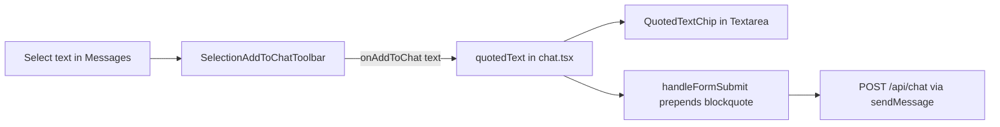

# Add to Chat (text selection quote)

## Product behavior

1. User selects text inside a conversation message.
2. A small floating **Add to chat** control appears near the selection (Grok-style).
3. Clicking it stores that text as composer context and shows a dismissible chip **above the textarea**, inside the composer stack (same visual slot as file previews).
4. On send, the quote is prepended to the user message as a markdown blockquote, then cleared:

```text
> selected text here

user's typed question
```

**Defaults (no extra product surface):** one quote at a time (replace on new Add); works in normal and compare timelines; chip shows truncated preview, full text is sent; empty/whitespace selection ignored.

## Why this shape (thermo-nuclear / ponytail)

[`components/chat.tsx`](components/chat.tsx) is already ~1520 lines and [`components/textarea.tsx`](components/textarea.tsx) is ~1012. Dumping selection listeners, positioning, and chip UI into those files is a structural regression.

**Code-judo move:** treat this like file attachments — thin state in `chat.tsx`, UI/behavior in focused modules — not a new context provider, not message-level reply plumbing, not API/schema changes.



## Implementation

### 1. Selection toolbar (new, self-contained)

Add:
- [`hooks/use-selection-add-to-chat.ts`](hooks/use-selection-add-to-chat.ts) — listen on a container ref for `mouseup` / `selectionchange`; read `window.getSelection()`; ignore selections outside the container or inside `textarea`/`input`; compute `getBoundingClientRect()` for placement; clear on Escape / scroll / empty selection.
- [`components/selection-add-to-chat-toolbar.tsx`](components/selection-add-to-chat-toolbar.tsx) — fixed/absolute pill with list icon + “Add to chat”; `onAdd(text)` then clears native selection.

Wire into [`components/messages.tsx`](components/messages.tsx) on the existing scroll container (`containerRef`) via a new optional `onAddToChat?: (text: string) => void`. Mirror the same prop on [`components/compare/CompareTimeline.tsx`](components/compare/CompareTimeline.tsx) so compare mode is not a special-case orphan.

Do **not** put listeners in [`components/message.tsx`](components/message.tsx) or [`components/markdown.tsx`](components/markdown.tsx).

### 2. Quote chip (new, tiny)

Add [`components/quoted-text-chip.tsx`](components/quoted-text-chip.tsx): icon + truncated text + dismiss `X`. Style to match existing composer cards (`bg-card border border-border rounded-xl`), same family as the file preview block in [`components/textarea.tsx`](components/textarea.tsx) (~649–663).

### 3. Minimal wiring in chat + textarea

In [`components/chat.tsx`](components/chat.tsx) only:
- `const [quotedText, setQuotedText] = useState<string | null>(null)`
- pass `onAddToChat={setQuotedText}` into `Messages` / `CompareTimeline`
- pass `quotedText` + `onClearQuotedText` into `Textarea`
- in `handleFormSubmit`, if `quotedText` is set, build:

```ts
const messageContent = quotedText
  ? `> ${quotedText.replace(/\n/g, '\n> ')}\n\n${draftInput}`
  : draftInput;
```

- clear `quotedText` with `setInput('')` on successful submit path; allow send when quote exists even if input is empty (quote-only follow-up), matching “context + ask” UX
- restore quote with draft on the existing error-restore paths only if we clear it early (prefer clear-on-success, keep quote until send succeeds — same spirit as draft restore)

In [`components/textarea.tsx`](components/textarea.tsx): add optional props `quotedText` / `onClearQuotedText`; render `<QuotedTextChip />` above the textarea (beside/above file preview). No selection logic here.

### 4. Spec

Update [`SPEC.md`](SPEC.md) §8.1 Chat Features with a short bullet: text selection → Add to chat → composer chip → markdown blockquote injection on send. No schema/API contract change.

### 5. Verification

- Manual: select assistant text → Add to chat → chip appears → dismiss works → send shows `>` quote in the user bubble.
- Manual: select in compare timeline; select inside composer (toolbar must not appear); replace quote by selecting again.
- `pnpm lint` on touched files. No new dependency.

## Explicit non-goals (keep the diff small)

- No multi-quote stack, no message-id reply threading, no server-side “quotedMessageId”
- No new Radix ContextMenu / Popover dependency for the toolbar (position from selection rect)
- No growth of selection logic inside `chat.tsx` / `message.tsx` / `markdown.tsx`
- No change to `POST /api/chat` body shape

## Quality bar (blockers if violated)

- Do not push substantial new logic into `chat.tsx` or `textarea.tsx` — extract first.
- Do not scatter `if (quotedText)` branches through unrelated flows (billing, MCP, files); only compose at the existing `messageContent` build site (~998).
- Do not introduce a React context for one nullable string.
- One quote string is the model; avoid flags like `isQuoteMode`.
