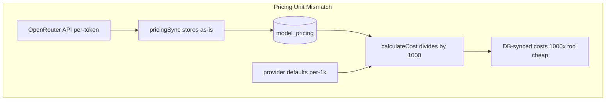

# Bug Fix Plan: Verified Issues and Improved Remedies

## Verification Summary

All six reported issues are **confirmed** in the current codebase. Minor corrections to the analysis:

| # | Analysis accuracy | Notes |
|---|-------------------|-------|
| 1 | Correct | [`processMessagesForPersistence`](lib/chat-message-persistence.ts) maps citations onto **every** assistant message in history (lines 187–201). |
| 2 | Correct | [`saveChat`](lib/chat-store.ts) uses check-then-insert (lines 78–165). Race only affects the insert path. |
| 3 | Correct | [`installPythonPackage`](lib/services/chatMCPServerService.ts) uses `args[args.indexOf('-m') + 1]` → `args[0]` when `-m` is absent (line 364). |
| 4 | Correct (with nuance) | [`PricingSyncService`](lib/services/pricingSync.ts) stores **per-token** OpenRouter prices (e.g. `0.000003`). [`CostCalculationService.calculateCost`](lib/services/costCalculation.ts) divides **all** sources by 1000 (lines 510–511), assuming per-1k. Default provider prices in `getDefaultProviderPricing` are per-1k and work with `/1000`. |
| 5 | Correct (wrong method name) | Bug is in `updateDailyTokenUsage` inside [`tokenTracking.ts`](lib/tokenTracking.ts) (lines 580–658), not `recordTokenUsage`. Unique index: `daily_token_usage_user_id_date_provider_idx`. |
| 6 | Correct | [`getAggregatedCosts`](lib/services/costCalculation.ts) calls `calculateCost` per record with `includeVolumeDiscounts` (line 749). Tiers start at 1M tokens; single records never qualify. `TokenTrackingService` already passes `includeVolumeDiscounts: false` for per-message tracking (line 476). |



---

## Recommended Fix Strategy (Code-Judo Over Scattered Branches)

### Phase 1 — Data corruption: Citation pollution (highest user impact)

**File:** [`lib/chat-message-persistence.ts`](lib/chat-message-persistence.ts)

**Use the suggested fix** — it is minimal and correct. Only mutate `assistantMessage`, then return `[...historyMessages, updatedAssistantMessage]`.

```typescript
// After citations extracted and assistantMessage possibly augmented:
if (citations.length === 0) return [...historyMessages, assistantMessage];

const updatedAssistantMessage = {
  ...assistantMessage,
  parts: assistantMessage.parts?.map((part) =>
    part.type === 'text' ? { ...part, citations } : part
  ) ?? [],
};
return [...historyMessages, updatedAssistantMessage];
```

**Tests:** Extend [`__tests__/lib/chat-message-persistence.test.ts`](__tests__/lib/chat-message-persistence.test.ts):
- Multi-turn history with a prior assistant message that already has citations → new turn's citations must **not** overwrite history.
- Only the final assistant message receives new citations.

**SPEC:** Brief note under web search / citation persistence that citations attach only to the current assistant turn.

---

### Phase 2 — Billing accuracy: Pricing unit mismatch

**Problem:** Two incompatible units coexist — synced DB rows are per-token; defaults/tests assume per-1k.

**Do NOT use** the suggested `pricingSource === 'database' ? price : price/1000` branch alone. That leaves:
- Duplicate logic in `calculateCostWithPricing` (line 287)
- `tokenTracking` fallback using `/ 1_000_000` (lines 519–521) — a third convention
- Tests mocking DB prices as per-1k while production sync stores per-token

**Preferred structural fix — normalize at the boundary:**

1. **At sync time** in [`lib/services/pricingSync.ts`](lib/services/pricingSync.ts): convert API per-token → canonical per-1k before insert:
   ```typescript
   inputTokenPrice: inputPrice * 1000,
   outputTokenPrice: outputPrice * 1000,
   metadata: { ..., priceUnit: 'per_1k_tokens', syncedFrom: 'per_token_api' }
   ```
2. **Keep** `calculateCost` division by 1000 unchanged (single invariant: all stored prices are per-1k).
3. **Add** `lib/services/pricingUnits.ts` with one helper:
   ```typescript
   export function toPerTokenPrice(storedPer1k: number): number {
     return storedPer1k / 1000;
   }
   ```
   Use in `calculateCost`, `calculateCostWithPricing`, and `tokenTracking` fallback — delete the `/ 1_000_000` path.
4. **One-time resync:** Run existing admin sync (`POST /api/admin/sync-pricing`) after deploy to rewrite active `model_pricing` rows. Document in plan gate — no hand-written migration required if resync is acceptable.

**Tests:** Update [`__tests__/services/cost-calculation.test.ts`](__tests__/services/cost-calculation.test.ts):
- Add case with realistic synced per-token value (e.g. Claude `0.000003` stored as `0.003` per-1k) → 1000 input tokens ≈ `$0.003`.
- Add pricingSync unit test asserting `0.000003` API input → `0.003` stored.

**SPEC:** Document `model_pricing.input_token_price` / `output_token_price` are **USD per 1,000 tokens**.

---

### Phase 3 — Concurrency: Atomic upserts (two sites)

#### 3a. `saveChat` race

**File:** [`lib/chat-store.ts`](lib/chat-store.ts)

**Partially adopt** suggested upsert, but **keep** the existing `findFirst` read for title-preservation logic (title quality, not correctness). Replace the insert/update branch with a single upsert:

```typescript
await db.insert(chats)
  .values({ id: chatId, userId, title: chatTitle, createdAt: new Date(), updatedAt: new Date() })
  .onConflictDoUpdate({
    target: chats.id,
    set: {
      // Only update title when we computed a non-default one, or preserve existing meaningful title
      title: chatTitle,
      updatedAt: new Date(),
    },
  });
```

Follow the pattern in [`lib/services/dailyMessageUsageService.ts`](lib/services/dailyMessageUsageService.ts) (lines 18–35) and [`lib/services/conversationPersistence.ts`](lib/services/conversationPersistence.ts) (lines 55–69).

**Tests:** New integration-style test in [`__tests__/lib/chat-store.test.ts`](__tests__/lib/chat-store.test.ts) mocking `db.insert().onConflictDoUpdate` — assert concurrent-safe path is used (no bare `insert` after `findFirst` miss).

#### 3b. Daily token usage race

**File:** [`lib/tokenTracking.ts`](lib/tokenTracking.ts) — replace `updateDailyTokenUsage` check-then-insert with upsert (user's suggested SQL is correct). Collapse ~70 lines of branch logic to ~25 lines mirroring `DailyMessageUsageService`.

**Tests:** Extend [`__tests__/services/token-tracking.test.ts`](__tests__/services/token-tracking.test.ts) — assert `onConflictDoUpdate` called with correct target `[userId, date, provider]` and increment expressions.

---

### Phase 4 — MCP Python install guard

**File:** [`lib/services/chatMCPServerService.ts`](lib/services/chatMCPServerService.ts)

**Use the suggested fix** — check `mIndex === -1 || mIndex + 1 >= args.length` before reading package name. Script-based stdio servers (`python3 server.py`) correctly skip auto-install.

**Tests:** New focused test file `__tests__/services/chatMCPServerService.test.ts` (or private method test via transport setup mock):
- `['-m', 'mcp_server']` → installs `mcp_server`
- `['/path/server.py']` → skips with diagnostic, no spawn

---

### Phase 5 — Volume discounts at aggregate level

**File:** [`lib/services/costCalculation.ts`](lib/services/costCalculation.ts)

**Direction of suggested fix is right; implementation should be structural:**

1. Extract `applyVolumeDiscount(subtotal, totalTokens, provider): { discountAmount, discountPercentage, applied }` from the tier loop in `calculateCost`.
2. In `getAggregatedCosts`:
   - Call `calculateCost(..., { includeVolumeDiscounts: false })` per record (user's suggestion).
   - Sum subtotals and tokens **per provider**.
   - If `includeVolumeDiscounts`, apply `applyVolumeDiscount` once per provider on the **cumulative** subtotal/token count.
   - Adjust `totalDiscount`, `totalCost`, and `breakdownByProvider[*].discountAmount/totalCost` accordingly.
3. Do **not** apply aggregate discounts to `breakdownByModel` or `breakdownByDay` unless product intent requires it — document as provider-level billing policy.

**Tests:** [`__tests__/services/cost-calculation.test.ts`](__tests__/services/cost-calculation.test.ts):
- Two records of 600k tokens each, same provider → aggregate 1.2M tokens → 5% OpenAI tier applies once to combined subtotal, not zero.

---

## Execution Order and Gates

Per [`.cursor/rules/plan-execution.mdc`](.cursor/rules/plan-execution.mdc), implement **one phase per gate**:

| Gate | Phase | Verification |
|------|-------|--------------|
| 1 | Citation pollution | `pnpm test:unit:ci -- --testPathPatterns="chat-message-persistence"` |
| 2 | Pricing normalization | `pnpm test:unit:ci -- --testPathPatterns="cost-calculation|pricingSync"` + manual resync note |
| 3 | Upserts (chat + daily tokens) | `pnpm test:unit:ci -- --testPathPatterns="chat-store|token-tracking"` |
| 4 | MCP Python guard | `pnpm test:unit:ci -- --testPathPatterns="chatMCPServerService"` |
| 5 | Volume discounts | `pnpm test:unit:ci -- --testPathPatterns="cost-calculation"` |

Full gate before merge: `pnpm test:unit:ci && pnpm lint`

---

## What We Reject From the Original Suggestions

- **Pricing `pricingSource` branch only** — treats symptom, leaves three conversion paths and inconsistent test/production data.
- **Bare `saveChat` upsert without title logic** — would regress meaningful-title preservation; keep read-then-upsert.
- **Volume discount fix inside `calculateCost` only** — must change `getAggregatedCosts` aggregation semantics, not per-record defaults.

---

## Regression Risk

- **Pricing resync** required for existing production `model_pricing` rows written as per-token; until resync, costs remain wrong for synced models.
- **Volume discount change** alters admin analytics totals for high-volume users (intended correction).
- **Citation fix** is backward-compatible for new saves; already-corrupted historical messages are not auto-repaired.
