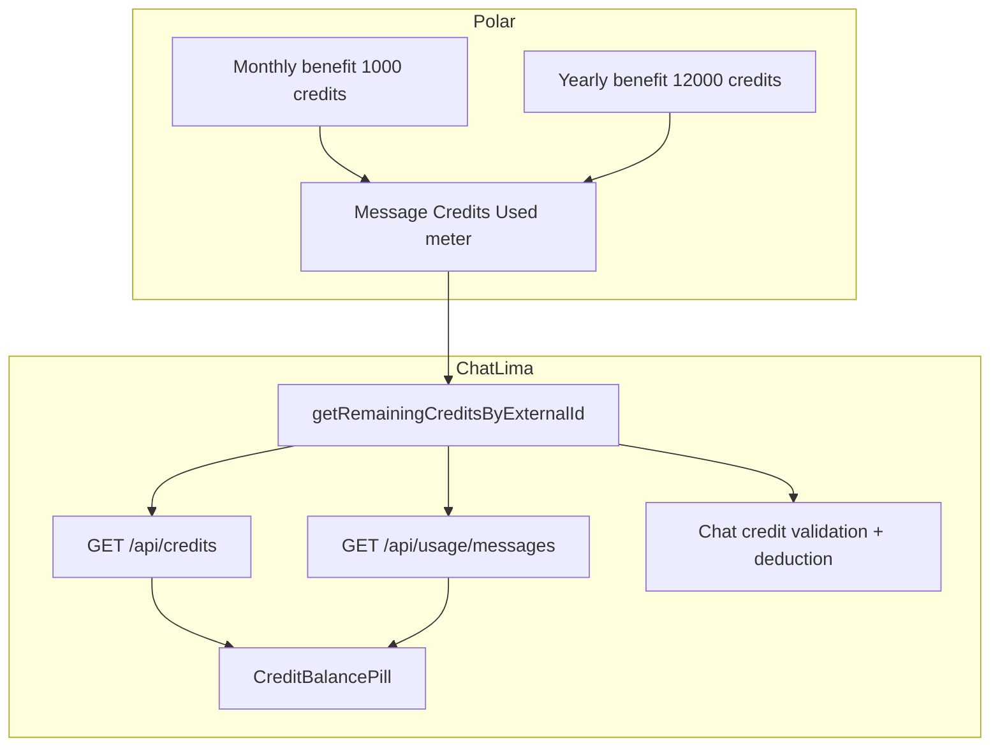

# Chat A + Sidebar A + yearly credits unification

## Problem

Polar yearly already grants **12,000 Message Credits** via Automated Benefits. ChatLima still treats yearly as “unlimited” in several paths (`hasUnlimitedFreeModels`, `credits: null`, `999999` daily limits, slug `free-models-unlimited`). That hides the real balance and diverges from product intent: **yearly = same credit system as monthly, larger grant**.

## Decisions (locked)

- **Remove unlimited usage** as a product/code concept for yearly. Both plans use the Polar `Message Credits Used` meter.
- **Yearly checkout slug**: rename `free-models-unlimited` → `ai-usage-yearly` (product ID env `POLAR_PRODUCT_ID_YEARLY` unchanged).
- **Display balances from Polar**, not fake unlimited:
  - Monthly: `{remaining} / 1,000 credits`
  - Yearly: `{remaining} / 12,000 credits`
  - Allowance denominators are app constants (`MONTHLY_CREDIT_ALLOWANCE = 1000`, `YEARLY_CREDIT_ALLOWANCE = 12000`) because Polar’s balance API does not return the grant size.
  - Free/anon (no sub / no credits): `{used}/{limit} msgs today`
- **Chat A**: Expandable chip under the **last assistant message** (in/out, credits this chat, msgs). No dollars.
- **Credits this chat**: Persist `creditsConsumed` on `token_usage_metrics.metadata`, sum for the chat.
- **Lifetime token/$ strip**: Delete from sidebar only. No Settings Usage tab in this change.

## Code-quality constraints (thermo-nuclear)

- [`components/chat.tsx`](components/chat.tsx) is already ~1,536 lines — extract token-metrics hook; shrink, don’t grow.
- Delete `hasUnlimitedFreeModels` end-to-end rather than leaving a dead flag that always returns false.
- One credit-display component; sidebar uses real remaining credits (from `usageData.credits` / credits API), not a second token-usage query.
- Prefer deleting unlimited branches over adding `if (yearly) showUnlimited` conditionals.

---

## Part 0 — Remove yearly unlimited + rename slug

### 0a. Delete / stop using `hasUnlimitedFreeModels`

Remove the helper and all bypasses:

| File | Change |
|------|--------|
| [`lib/polar.ts`](lib/polar.ts) | Delete `hasUnlimitedFreeModels` (keep `getSubscriptionTypeByExternalId` for monthly/yearly labeling) |
| [`app/api/credits/route.ts`](app/api/credits/route.ts) | Remove yearly early-return; always return Polar meter `credits` (number or null). Drop `hasUnlimitedFreeModels` from response |
| [`lib/auth.ts`](lib/auth.ts) `checkMessageLimit` | Remove yearly `999999` branch; yearly falls through to same Polar-credits / daily-limit path as monthly |
| [`lib/services/dailyMessageUsageService.ts`](lib/services/dailyMessageUsageService.ts) | Remove yearly unlimited daily-limit bypass |
| [`hooks/useCredits.ts`](hooks/useCredits.ts) | Remove `hasUnlimitedFreeModels` state and “always true” short-circuits |
| [`app/model/[slug]/page.tsx`](app/model/[slug]/page.tsx) | Remove unlimited free-models access branch; use credits/subscription like monthly |
| [`lib/types/api.ts`](lib/types/api.ts), [`lib/middleware/auth.ts`](lib/middleware/auth.ts), [`app/api/usage/messages/route.ts`](app/api/usage/messages/route.ts) | Remove `hasUnlimitedFreeModels` field / hard-coded `false` |

After this, yearly with a Polar balance of 12000 behaves like monthly with 1000: gate on remaining credits, deduct on use, show remaining in UI.

**Subscribed users with credits > 0** already skip daily message caps via the credit path — yearly keeps that behavior without a special unlimited flag.

### 0b. Rename checkout slug → `ai-usage-yearly`

| File | Change |
|------|--------|
| [`lib/auth.ts`](lib/auth.ts) Polar products | `slug: 'ai-usage-yearly'` (still `POLAR_PRODUCT_ID_YEARLY`) |
| [`app/upgrade/page.tsx`](app/upgrade/page.tsx) | `handleCheckout('ai-usage-yearly')`; copy → “~12,000 credits per year” (not “High annual usage allowance”) |
| [`components/checkout-button.tsx`](components/checkout-button.tsx) | Type + default slug `ai-usage-yearly` |
| [`app/checkout/success/page.tsx`](app/checkout/success/page.tsx) | Detect `product_slug === 'ai-usage-yearly'`; success copy mentions ~12,000 credits |
| [`app/faq/page.tsx`](app/faq/page.tsx), [`README.md`](README.md), [`SPEC.md`](SPEC.md) | Align yearly with monthly credit model |

Do **not** keep a permanent alias to `free-models-unlimited` unless a short redirect is needed for in-flight checkouts; default is hard rename of all app call sites.

### 0c. Copy / product vocabulary

- Monthly: ~1,000 credits/month  
- Yearly: ~12,000 credits/year (same catalog, same 1–30 credits/msg tiers)  
- Remove “unlimited”, “free-models-unlimited”, “hasUnlimitedFreeModels”, “High annual usage allowance” from user-facing and code identifiers where they mean yearly bypass

---

## Part 1 — Persist credits consumed per turn (Chat A data)

In [`lib/services/directTokenTracking.ts`](lib/services/directTokenTracking.ts), when inserting `token_usage_metrics`:

- Compute `creditsConsumed` with billing rules (`calculateCreditCostPerMessage` + `additionalCost`, `0` when not deducting).
- Store as `metadata.creditsConsumed`.

In [`lib/tokenTracking.ts`](lib/tokenTracking.ts) `getChatTokenUsage`:

- Sum → `totalCreditsConsumed` on the chat aggregate.

Older rows without the field contribute `0`; chip omits credits segment when `0`.

---

## Part 2 — Chat A chip under last assistant message

**Extract** [`hooks/useChatTokenMetrics.ts`](hooks/useChatTokenMetrics.ts) from `chat.tsx`.

**Add** [`components/token-metrics/ChatUsageChip.tsx`](components/token-metrics/ChatUsageChip.tsx):

- Collapsed: `7.7K · 3 cr · 8 msgs` (omit `cr` when 0)
- Expanded: In → Out, credits this chat, message count
- No dollars

**Render** in [`components/messages.tsx`](components/messages.tsx) when `status === "ready"` and last message is assistant.

**Remove** footer `ChatTokenSummary compact` from `chat.tsx`.

---

## Part 3 — Sidebar A credit balance pill

**Add** constants in [`lib/constants.ts`](lib/constants.ts) (or credit helpers):

- `MONTHLY_CREDIT_ALLOWANCE = 1000`
- `YEARLY_CREDIT_ALLOWANCE = 12000`

**Add** [`components/credit-balance-pill.tsx`](components/credit-balance-pill.tsx):

| User state | Display |
|------------|---------|
| Monthly sub | `{credits} / 1,000 credits` |
| Yearly sub | `{credits} / 12,000 credits` |
| Free / anon | `{used}/{limit} msgs today` |
| Loading / no user | nothing |

Data: `useAuth().usageData` (`credits`, `subscriptionType`, `used`, `limit`). Ensure [`app/api/usage/messages/route.ts`](app/api/usage/messages/route.ts) returns real Polar `credits` for **both** monthly and yearly (today it already fetches credits for any `hasSubscription`; after Part 0, yearly is no longer null’d by `/api/credits`).

**Wire** in [`components/chat-sidebar.tsx`](components/chat-sidebar.tsx): delete `TokenUsageSummary` / `MiniChatTokenSummary`; mount pill in the same expanded slot.

---

## Part 4 — Spec + verification

- Update [`SPEC.md`](SPEC.md) §4/§7: yearly = 12,000 credits/year on same meter; remove unlimited yearly wording.
- Update upgrade/FAQ/README success copy.
- Tests: credits API no longer returns unlimited flag; `useCredits` / sidebar / checkout slug; daily usage no longer 999999 for yearly.
- `pnpm lint` on touched files; smoke monthly + yearly balance display and one chat deduction.

## Out of scope

- Changing Polar dashboard benefits (already 12000 / 1000)
- Settings Usage tab / `TokenMetricsDashboard`
- Reading grant size from Polar API (use constants)
- Per-message historical token enrichment
- Collapsed-sidebar credit icon mode
- Migrating historical checkout URLs beyond in-app slug rename
