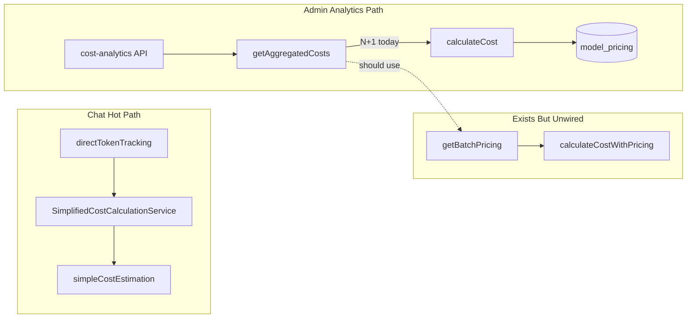

# Complexity Analysis Verification and Simplification Plan

## Analysis Verdict

| # | Finding | Verdict | Key nuance |
|---|---------|---------|------------|
| 1 | [`creditCache.ts`](lib/services/creditCache.ts) overengineered vs React `cache()` | **Correct** | Debug APIs (`clear`, `size`, `getStats`, `hasExternalId`, `hasPolarId`) are unused outside the file. Multiple call sites create **separate** cache instances today ([`app/api/chat/route.ts`](app/api/chat/route.ts), [`chatCreditValidationService.ts`](lib/services/chatCreditValidationService.ts), [`compareOrchestrator.ts`](lib/chat/compareOrchestrator.ts)) — React `cache()` would dedupe automatically. Same smell exists in [`messageLimitCache.ts`](lib/services/messageLimitCache.ts). |
| 2 | N+1 in [`getAggregatedCosts`](lib/services/costCalculation.ts) | **Correct** | Loop at lines 740–761 calls `calculateCost`, which queries `model_pricing` per record (lines 453–462). |
| 2b | Dead `pricingCache` in `calculateCost` | **Partially wrong** | Cache is **not dead** — it is used by private `getBatchPricing` (lines 1170–1261). The real bug is **`getBatchPricing` and `calculateCostWithPricing` exist but are never wired in**; `calculateCostWithPricing` has zero call sites. |
| 3 | Double query in [`getDailyUsage`](lib/services/dailyMessageUsageService.ts) | **Correct, low priority** | Two queries (lines 66–83) can be one LEFT JOIN. Called on limit checks, not admin aggregation hot paths. |
| 4 | Per-user transactions in [`userCleanupService`](lib/services/userCleanupService.ts) | **Correct, with tradeoff** | Lines 325–350 open one transaction per user (up to 50). Bulk `inArray` deletes are faster but lose **per-user partial success** on FK failures. Admin-only path — lower priority than billing/analytics. |
| 5 | `setInterval` in [`simpleCostEstimation.ts`](lib/services/simpleCostEstimation.ts) | **Correct** | Module-level timer at lines 114–117 is a serverless anti-pattern. Lazy TTL check already exists in `estimateCost` (lines 49–50). `cleanupCache()` + timer can be deleted entirely. |
| 6 | Regex HTML parsing in [`webFetchService.ts`](lib/services/webFetchService.ts) | **Partially correct** | Custom regex/entity decoder (lines 500–631) is fragile. ReDoS risk is **mitigated** by fetch/truncation limits (`maxChars`, SSRF checks). `cheerio` is **not** a current dependency; `turndown` already is. Valid cleanup, not urgent. |
| 7 | Runtime MCP package install | **Correct (structural)** | [`ensureUvInstalled`](lib/services/chatMCPServerService.ts) / [`installPythonPackage`](lib/services/chatMCPServerService.ts) still spawn `pip3`/`uv pip install` at request time. The completed bug-fix plan only added the `-m` guard — it did **not** remove runtime installs. |

**Not mentioned in analysis but relevant:** Two parallel cost systems coexist — [`SimplifiedCostCalculationService`](lib/services/simplifiedCostCalculation.ts) (hot chat path via `directTokenTracking`) and [`CostCalculationService`](lib/services/costCalculation.ts) (admin analytics, 1262 lines, already past 1k). The N+1 fix should not expand the big service further; it should **activate existing dead helpers** or extract modules.



---

## Recommended Simplification Strategy (Priority Order)

### Phase 0 — Provider-truth costs + backfill (confirmed scope)

**Goal:** Admin dollar analytics use stored OpenRouter actuals, not recalculated `model_pricing`. Retire `CostCalculationService` for analytics.

**0a. Strengthen write-time capture** ([`directTokenTracking.ts`](lib/services/directTokenTracking.ts))
- Always persist `metadata.generationId` when extractable
- Add `metadata.costSource`: `'openrouter_response' | 'openrouter_generation' | 'estimated'`
- Inline cost into `messageCostResolver.ts`; delete `SimplifiedCostCalculationService` wrapper
- Keep async `/generation` backfill (already exists)

**0b. Replace admin analytics** (new [`usageCostAggregation.ts`](lib/services/usageCostAggregation.ts) or extend `TokenTrackingService`)
- `SUM(COALESCE(actual_cost, estimated_cost))` grouped by provider / model / day
- Projections and limits = simple math on aggregated totals
- Wire [`/api/cost-analytics`](app/api/cost-analytics/route.ts) and [`/api/usage/cost`](app/api/usage/cost/route.ts)

**0c. Backfill job** (cron/script, not on-demand UI)
- Rows where `actualCost IS NULL` and `metadata.generationId` present → `OpenRouterCostTracker.fetchActualCost`

**0d. Retire** `CostCalculationService` dollar path (`getAggregatedCosts`, `calculateCost`, volume discounts). Keep `model_pricing` sync only for optional admin catalog/margin tooling.

**Gate:** `pnpm test:unit:ci -- --testPathPatterns="token-tracking|directTokenTracking"`

---

### Phase 1 — Wire existing batch pricing ~~(CANCELLED)~~

**Status: Cancelled.** Only needed for theoretical "cost at current catalog pricing" — not required for provider-truth analytics.

~~**Problem:** Analysis proposes new batch logic; codebase already has it — just unused.~~

**Original proposal (do not implement unless theoretical recalc is requested later):**

**Changes in [`lib/services/costCalculation.ts`](lib/services/costCalculation.ts):**

1. In `getAggregatedCosts`, before the record loop:
   - Collect unique `{ modelId, provider }` pairs from `records`
   - Call existing `getBatchPricing(uniquePairs, { currency, ... })`
2. Replace per-record `calculateCost(...)` with existing `calculateCostWithPricing(..., pricingMap.get(key), { includeVolumeDiscounts: false })`
3. Keep provider-level `applyVolumeDiscount` aggregation (already fixed at lines 866–881)
4. Strip per-record `logDiagnostic` calls inside the loop (33 diagnostic calls in this file; loop logging is the "hundreds of logs" smell)

**Do not:** Add a third pricing path or duplicate batch-fetch logic from the analysis doc.

**Tests:** Extend [`__tests__/services/cost-calculation.test.ts`](__tests__/services/cost-calculation.test.ts):
- Mock `db.query.modelPricing.findMany` once for N records with 2 unique model/provider pairs → assert single batch query, correct totals
- Preserve existing volume-discount aggregate test from bug-fix plan

**Gate:** `pnpm test:unit:ci -- --testPathPatterns="cost-calculation"`

---

### Phase 2 — Replace `RequestCreditCache` with React `cache()`

**Problem:** 178-line custom class + factory + optional cache parameter for what React provides natively.

**Changes:**

1. Rewrite [`lib/services/creditCache.ts`](lib/services/creditCache.ts) to ~40 lines:
   ```typescript
   import { cache } from 'react';
   export const getCachedCreditsByExternalId = cache(originalGetRemainingCreditsByExternalId);
   export const getCachedCredits = cache(originalGetRemainingCredits);
   ```
2. Simplify `hasEnoughCreditsWithCache` — remove optional `creditCache` param; call cached functions directly
3. Update call sites to stop using `createRequestCreditCache()`:
   - [`app/api/chat/route.ts`](app/api/chat/route.ts)
   - [`lib/services/chatCreditValidationService.ts`](lib/services/chatCreditValidationService.ts)
   - [`lib/chat/compareOrchestrator.ts`](lib/chat/compareOrchestrator.ts)
   - [`lib/auth.ts`](lib/auth.ts) (optional param type)
4. Update mocks in [`__tests__/services/chatCreditValidationService.test.ts`](__tests__/services/chatCreditValidationService.test.ts) and [`__tests__/api/chat-route-web-search.test.ts`](__tests__/api/chat-route-web-search.test.ts)

**Out of scope for this phase (follow-up):** [`messageLimitCache.ts`](lib/services/messageLimitCache.ts) — same pattern, but DB-backed; evaluate separately.

**Gate:** `pnpm test:unit:ci -- --testPathPatterns="chatCreditValidation|chat-route-web-search"`

---

### Phase 3 — Remove serverless timer from cost estimation

**Changes in [`lib/services/simpleCostEstimation.ts`](lib/services/simpleCostEstimation.ts):**
- Delete `cleanupCache()` method (lines 104–111)
- Delete module-level `setInterval` (lines 114–117)
- Keep lazy TTL eviction in `estimateCost` (already correct)

**Gate:** No dedicated test file today — run `pnpm test:unit:ci` (smoke) or add a 2-line test if desired.

---

### Phase 4 — MCP: verify-only at runtime (replace install-on-request)

**Problem:** Analysis is correct; current guard only prevents crash when `-m` is missing.

**Changes in [`lib/services/chatMCPServerService.ts`](lib/services/chatMCPServerService.ts):**

1. Replace `ensureUvInstalled` / `installPythonPackage` with lightweight **availability checks** (`which uv`, `python3 -c "import …"`) that log diagnostics and throw a clear setup error if missing
2. Remove `spawn('pip3', ['install', 'uv'])` and `spawn('uv', ['pip', 'install', …])` from request path
3. Document required MCP runtime deps in [`SPEC.md`](SPEC.md) §6 (local/self-hosted vs Vercel serverless constraints)

**Tests:** Extend [`__tests__/services/chatMCPServerService.test.ts`](__tests__/services/chatMCPServerService.test.ts) — verify no install spawn on missing package; verify skip for script-based servers.

**Gate:** `pnpm test:unit:ci -- --testPathPatterns="chatMCPServerService"`

---

### Phase 5 — Smaller wins (optional, lower priority)

#### 5a. `getDailyUsage` single query
Combine the two queries in [`dailyMessageUsageService.ts`](lib/services/dailyMessageUsageService.ts) with LEFT JOIN as analysis suggests. Preserve `getDailyMessageLimit` helper.

#### 5b. User cleanup batching
In [`userCleanupService.ts`](lib/services/userCleanupService.ts), use **one transaction** with bulk `inArray` deletes for the happy path, but keep per-user error reporting via:
- Pre-flight validation query, or
- Chunked batches (e.g. 10 users) so one FK failure does not roll back all 50

Do **not** blindly adopt the analysis's all-or-nothing bulk delete without an error-isolation story.

#### 5c. `webFetchService` HTML parsing
Replace regex extractors with `cheerio` (new dependency) **only if** web-fetch reliability issues exist in production. Otherwise defer — current truncation limits reduce ReDoS urgency.

#### 5d. `costCalculation.ts` decomposition (structural)
After Phase 1, extract to reduce the 1262-line file:
- `costPricingLookup.ts` — `getBatchPricing`, provider defaults
- `costAggregation.ts` — `getAggregatedCosts`, breakdown rollups
- Keep thin `CostCalculationService` facade for API compatibility

---

## What to Reject From the Analysis

- **"Dead caching logic"** — misleading; cache works in `getBatchPricing`, which is orphaned not broken
- **Rewriting batch fetch from scratch** — wire `getBatchPricing` + `calculateCostWithPricing` instead
- **Bulk user cleanup without error isolation** — trades latency for brittle all-or-nothing behavior
- **Immediate cheerio migration** — valid long-term, but adds dependency for moderate gain given truncation/SSRF guards

---

## Execution Order and Gates

Per [`.cursor/rules/plan-execution.mdc`](.cursor/rules/plan-execution.mdc), implement **one phase per gate**:

| Gate | Phase | Risk | Verification |
|------|-------|------|--------------|
| **0** | Provider-truth costs + backfill | Medium (admin totals change to stored actuals) | token-tracking + directTokenTracking tests |
| 1 | ~~Batch pricing~~ | Cancelled | — |
| 2 | React `cache()` credits | Medium (chat credit checks) | credit validation + chat route tests |
| 3 | Remove setInterval | Low | unit CI smoke |
| 4 | MCP verify-only | Medium (MCP stdio servers) | chatMCPServerService tests |
| 5 | Optional smaller wins | Low–medium | targeted tests per item |

Full pre-merge: `pnpm test:unit:ci && pnpm lint`

**SPEC updates:** Phase 0 (authoritative cost = stored `actualCost`); Phase 4 (MCP runtime requirements).

---

## Regression Risk Summary

- **Phase 0:** Admin dollar totals will change (recalculated pricing → stored OpenRouter actuals). Intended. Rows without actuals use `estimatedCost` until backfill runs.
- **Phase 2:** Credit deduplication across nested service calls within one request — behavior improvement, but test mocks need updating
- **Phase 4:** Local dev MCP servers that relied on auto-install will need documented setup (`uv`, packages pre-installed)
- **Phases 5c/5d:** Deferred unless explicitly approved — larger diffs with lower immediate payoff
