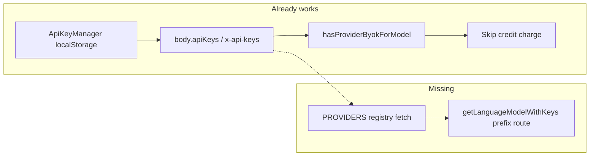

# Direct-Provider BYOK Support

## Problem

Settings already lets users save keys for OpenAI, Anthropic, Groq, and xAI. Client storage, request propagation, access gating, and credit-skip already treat all six providers the same. What is missing:

1. **Catalog** — `[lib/models/provider-configs.ts](lib/models/provider-configs.ts)` only registers OpenRouter + Requesty, so direct models never appear in the picker.
2. **Routing** — `[ai/providers.ts](ai/providers.ts)` `getLanguageModelWithKeys` only dynamically routes `openrouter/` and `requesty/`; direct SDKs only serve four legacy bare IDs (`gpt-5-nano`, `claude-3-7-sonnet`, `qwen-qwq`, `grok-3-mini`).

Saving a key therefore does nothing useful for those providers.



## Chosen approach (code judo)

Extend the **existing** OpenRouter/Requesty pattern — do not invent a curated allowlist system or silently rewrite `openrouter/...` selections to direct providers.

- Register `openai`, `anthropic`, `groq`, `xai` in `PROVIDERS`.
- Models appear only when a user or env key exists (same as today).
- IDs stay namespaced: `openai/gpt-4.1`, `anthropic/claude-sonnet-4-...`, `groq/...`, `xai/grok-4`.
- `openrouter/openai/...` and `openrouter/x-ai/...` remain OpenRouter (web search / image gen stay OpenRouter-only per SPEC §8.1).
- Prefer deleting branching over adding four copy-pasted parsers and four more `startsWith` blocks.

This generalizes [docs/plans/2026-06-01-xai-byok-support-implementation-plan.md](docs/plans/2026-06-01-xai-byok-support-implementation-plan.md) to all four direct providers in one pass.

## Structural moves (quality bar)

### 1. Shared OpenAI-compatible catalog parser

OpenAI, Groq, and xAI all expose `{ data: [{ id, ... }] }` model lists. Do **not** paste three Requesty-sized parsers into `[provider-configs.ts](lib/models/provider-configs.ts)` (364 lines today — would approach the 1k smell).

- Extract a small factory, e.g. `createOpenAiCompatibleParser({ providerName, idPrefix, isChatModel, capabilityHints })`.
- Keep Anthropic as a thin sibling parser (same `{ data: [...] }` shape, different metadata).
- Prefer a new module such as `[lib/models/direct-provider-parsers.ts](lib/models/direct-provider-parsers.ts)` so `provider-configs.ts` stays a registry, not a dump.

Filter aggressively: drop embeddings / audio / image-only / non-chat IDs from OpenAI and similar junk from Groq. Set `supportsWebSearch: false` for all direct models.

### 2. Auth headers on `ProviderConfig` (needed for Anthropic)

`[fetch-models.ts](lib/models/fetch-models.ts)` hardcodes Bearer auth (lines 156–163). Anthropic needs `x-api-key` + `anthropic-version`.

Extend `[ProviderConfig](lib/types/models.ts)`:

```ts
getHeaders?: (apiKey: string) => Record<string, string>;
```

Default remains Bearer. Anthropic supplies the Anthropic headers. Use the same helper for health checks. One config field — no Anthropic `if` sprinkled through fetch.

### 3. Prefix dispatch instead of more if-ladders

In `[getLanguageModelWithKeys](ai/providers.ts)`, replace growing `startsWith` / switch sprawl with a prefix → client map for the four direct providers (keep OpenRouter/Requesty special cases that need reasoning middleware).

Also:

- Point title defaults at prefixed IDs (`openai/gpt-5-nano`, `xai/grok-3-mini`, etc.) in `getTitleGenerationModelId`.
- Detect `openai/`, `anthropic/`, `groq/`, `xai/` prefixes there (today it only matches bare `gpt-` / `claude-` / …).
- Keep legacy bare-ID switch cases for one release; add `MODEL_MIGRATIONS` for `gpt-5-nano` → `openai/gpt-5-nano`, `claude-3-7-sonnet` → `anthropic/claude-3-7-sonnet-20250219` (or current Anthropic alias), `qwen-qwq` → `groq/qwen-qwq-32b`, `grok-3-mini` → `xai/grok-3-mini`.

### 4. One missing-key helper in stream plan

`[buildChatStreamPlan.ts](lib/chat/buildChatStreamPlan.ts)` only fail-fasts missing OpenRouter keys. Generalize via existing `getProviderApiKeyName` from `[accessGateService.ts](lib/services/accessGateService.ts)`: if model has a provider prefix and neither body key nor env key exists, return `MISSING_API_KEY`. Do not add four new `if (startsWith(...))` blocks.

### 5. Do not touch what already works

No changes needed for: `[api-key-manager.tsx](components/api-key-manager.tsx)`, key propagation in chat/model-context/`use-models`, access gate map, credit skip. `[prepareMessagesForModel.ts](lib/chat/prepareMessagesForModel.ts)` already skips OpenRouter format conversion for non-OR/Requesty models — leave that alone.

## Endpoints to register

| Provider  | Endpoint                                | Auth                                          |
| --------- | --------------------------------------- | --------------------------------------------- |
| OpenAI    | `https://api.openai.com/v1/models`      | Bearer                                        |
| Anthropic | `https://api.anthropic.com/v1/models`   | `x-api-key` + `anthropic-version: 2023-06-01` |
| Groq      | `https://api.groq.com/openai/v1/models` | Bearer                                        |
| xAI       | `https://api.x.ai/v1/models`            | Bearer                                        |

During implementation, smoke-check each endpoint once with a real/dev key and adjust filters if response shape differs.

## SPEC updates

Update `[SPEC.md](SPEC.md)` §5.2 to list all six dynamic sources; clarify §5.3 that direct vs OpenRouter-hosted IDs are distinct billing/routing namespaces; note in §8.1 that web search / image gen remain OpenRouter-only even when a direct provider key is present.

## Tests (focused)

- Parser unit tests for OpenAI-compatible factory + Anthropic parser (prefix, filter junk models, `supportsWebSearch: false`).
- `getLanguageModelWithKeys` routes `openai/`, `anthropic/`, `groq/`, `xai/` to the right client factories (mock SDKs).
- Existing access-gate tests already assume prefixed IDs — keep them green; add one migration test if migrations are added.
- Avoid broad E2E against live provider APIs in CI.

## Verification

- `pnpm test:unit` for new/updated unit tests
- `pnpm lint` on touched files
- Manual: save each key in Settings → confirm picker shows that provider’s models → send one chat → confirm no credit deduction when BYOK matches
- Confirm `openrouter/openai/...` still requires OpenRouter key / credits, not `OPENAI_API_KEY`

## Out of scope

- Web search or image generation on direct providers
- Silently spending `XAI_API_KEY` / `OPENAI_API_KEY` when the user selected an OpenRouter model
- Persisting API keys server-side
- Redesigning the Settings API Keys UI (already complete)
