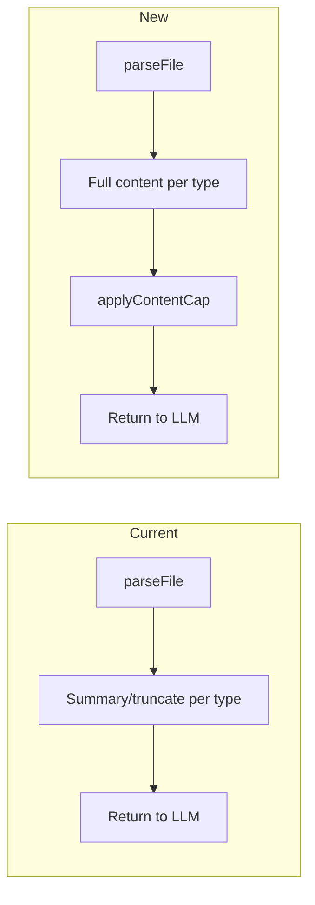

# Full file content with safety cap (Option 1)

## Goal

- **CSV**: Return full table as text (all rows), not just a 5-row summary.
- **Excel**: Return full workbook data (all sheets, all rows), not a 3-row-per-sheet summary.
- **PDF**: Return full extracted text (and optional metadata), no 5k preview truncation.
- **Text / code**: Return full file content, no 10k/15k preview truncation.
- **Safety**: Apply one global character limit (e.g. 500k). If content exceeds it, truncate and append: `[Content truncated. Total length: N characters]`.

All changes are in [lib/file-reader/](lib/file-reader/); the only consumer is [app/api/chat/route.ts](app/api/chat/route.ts) via `parseFile()`, which requires no changes.

---

## 1. Global cap and helper in index

**File:** [lib/file-reader/index.ts](lib/file-reader/index.ts)

- Add a constant, e.g. `MAX_FILE_CONTENT_CHARS = 500_000` (~100k–125k tokens).
- Add helper `applyContentCap(content: string): string`: if `content.length <= MAX_FILE_CONTENT_CHARS` return `content`; otherwise return `content.substring(0, MAX_FILE_CONTENT_CHARS) + '\n\n[Content truncated. Total length: ' + content.length + ' characters]'`.
- After building `content` for every successful path, set `content = applyContentCap(content)` before returning. This keeps the cap in one place.

---

## 2. CSV: full content and no row limit

**File:** [lib/file-reader/csv-parser.ts](lib/file-reader/csv-parser.ts)

- **Remove row cap:** Delete the `maxRows = 10000` limit and loop over all lines (e.g. `for (let i = 1; i < lines.length; i++)`). This makes parsing return all rows; the global character cap in `index.ts` will limit what is sent to the LLM.
- **Add full-content serializer:** Add and export `csvToFullContent(data: Record<string, unknown>[], headers: string[]): string`:
  - Emit a header line: headers joined by comma (escape values that contain comma/newline with double quotes).
  - Emit one line per row: same delimiter/escaping so the result is valid CSV-style text.
  - No “first 5 rows” or summary; entire `data` array is serialized.

**File:** [lib/file-reader/index.ts](lib/file-reader/index.ts)

- In the CSV branch, use `csvToFullContent(result.data, result.headers)` instead of `csvToSummary(...)`, then pass the result through `applyContentCap(content)`.

---

## 3. Excel: full content and no row limit

**File:** [lib/file-reader/excel-parser.ts](lib/file-reader/excel-parser.ts)

- **Remove row cap:** Stop slicing sheet data (remove `jsonData.slice(0, maxRowsPerSheet)`); use full `jsonData` so all rows are included.
- **Add full-content serializer:** Add and export `excelToFullContent(sheets: string[], sheetData: Record<string, Record<string, unknown>[]>): string`:
  - For each sheet: a short header line (e.g. `## Sheet: "SheetName"`) then serialize every row (e.g. header row with column names, then one line per row with values, or a simple key-value style so the full data is readable). Prefer a consistent, readable format (e.g. column names then rows) so the LLM sees the full table(s).
- Keep `generateExcelSummary` for now if needed elsewhere; the main export path in `index.ts` will use `excelToFullContent` and the global cap.

**File:** [lib/file-reader/index.ts](lib/file-reader/index.ts)

- In the Excel branch, use `excelToFullContent(result.data.sheets, result.data.sheetData)` (or the new function’s signature) instead of `result.data.summary`, then `applyContentCap(content)`.

---

## 4. PDF: full text + optional metadata

**File:** [lib/file-reader/index.ts](lib/file-reader/index.ts)

- In the PDF branch, build `content` from full `result.text` and optional metadata (e.g. title, author, pages) in a short header, e.g. same style as current `pdfToSummary` but without the 5k truncation: use full `result.text`. Then `content = applyContentCap(content)`.
- No change required in [lib/file-reader/pdf-parser.ts](lib/file-reader/pdf-parser.ts); `parsePDF` already returns full text. The existing `pdfToSummary` can remain for tests or other callers.

---

## 5. Text and code: full content

**File:** [lib/file-reader/index.ts](lib/file-reader/index.ts)

- **Text:** Build `content` as a short optional header (e.g. `File: ${filename}\n\n`) plus full `textResult.text` (no use of `textToSummary`’s 10k truncation). Then `applyContentCap(content)`.
- **Code:** Build `content` as optional header (filename, language) plus full code in markdown fenced block (reuse language detection from current `codeToSummary`), without the 15k truncation. Then `applyContentCap(content)`.

No changes required in [lib/file-reader/text-parser.ts](lib/file-reader/text-parser.ts) for the main flow; `parseText` already returns full text. Existing `textToSummary` and `codeToSummary` can stay for backward compatibility or tests.

---

## 6. Exports and tests

- **Exports:** Keep exporting `csvToSummary`, `pdfToSummary`, `textToSummary`, `codeToSummary` from [lib/file-reader/index.ts](lib/file-reader/index.ts) so existing tests (e.g. **[tests**/lib/pdf-parser.test.ts](__tests__/lib/pdf-parser.test.ts)) and any other callers continue to work.
- **Tests:** Add or update tests to assert: (1) small CSV/Excel/PDF/text/code return full content (no truncation note); (2) content longer than `MAX_FILE_CONTENT_CHARS` is truncated and ends with the “[Content truncated. Total length: N characters]” message. Optionally add a unit test for `applyContentCap` and for `csvToFullContent` / `excelToFullContent` with a few rows.

---

## 7. Documentation

- If [SPEC.md](SPEC.md) (or similar) describes file-reader or `read_file` behavior, add a short note that the LLM receives full file content up to a configurable safety cap (e.g. 500k characters), beyond which content is truncated with an explicit note.

---

## Flow summary

- **CSV:** `parseCSV` (all rows) → `csvToFullContent` → `applyContentCap` → return.
- **Excel:** `parseExcel` (all rows) → `excelToFullContent` → `applyContentCap` → return.
- **PDF:** `parsePDF` → metadata + full text → `applyContentCap` → return.
- **Text/Code:** `parseText` → header + full text/code → `applyContentCap` → return.

No changes to [app/api/chat/route.ts](app/api/chat/route.ts); it already passes `parseResult.content` to the tool result.