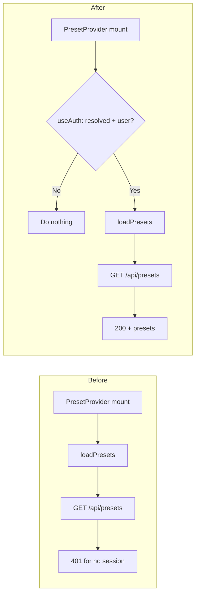

# Load presets only when the user is authenticated

## Current behavior

- [lib/context/preset-context.tsx](lib/context/preset-context.tsx): `PresetProvider` runs a `useEffect` on mount that always calls `loadPresets()`.
- `loadPresets()` calls `GET /api/presets`, which returns 401 "Authentication required" when there is no session ([app/api/presets/route.ts](app/api/presets/route.ts) lines 29–32).
- Auth state is available from `AuthProvider` (parent in [app/providers.tsx](app/providers.tsx)) via `useAuth()` in [lib/context/auth-context.tsx](lib/context/auth-context.tsx), which exposes `user`, `isPending`, and `status` ('loading' | 'authenticated' | 'anonymous' | 'unauthenticated').

So the error appears when: (1) the user is not signed in, or (2) the first request runs before auth has resolved (e.g. before session is available).

## Approach

Use auth context inside `PresetProvider` and only run the initial load when auth has resolved and a session exists. Optionally clear presets when the user logs out so the UI does not show another user’s presets.

## Implementation steps

1. **Use auth in PresetProvider**
  In [lib/context/preset-context.tsx](lib/context/preset-context.tsx):
  - Import `useAuth` from `@/lib/context/auth-context` (or `@/hooks/useAuth`).
  - At the top of `PresetProvider`, call `useAuth()` and read at least:
    - `isPending` (or equivalent) so we know when auth has finished resolving.
    - A “has session” signal: e.g. `user !== null` or `session?.user?.id`.  
     The API accepts any session (including anonymous); use “has session” so we don’t call the API when we know there is no user.
2. **Gate the initial load on auth**
  Replace the current mount effect that unconditionally calls `loadPresets()` with an effect that:
  - Runs when auth state and/or `loadPresets` changes (dependencies: e.g. `isPending`, `user` or `session?.user?.id`, and `loadPresets`).
  - Calls `loadPresets()` only when auth is not pending and the user has a session (`!isPending && user` or equivalent).
  - Does not call `loadPresets()` when `isPending` is true or when there is no user.
3. **Reload when user appears (e.g. after sign-in)**
  Rely on the same effect: when the user transitions from “no user” to “has user” (e.g. after sign-in or after auth resolves with an anonymous session), the effect runs again and calls `loadPresets()` once.
4. **Optional: clear presets on sign-out**
  In the same effect (or a small separate effect), when the user becomes null (e.g. after sign-out), set presets to `[]`, clear `activePreset`, and clear `error` so the UI does not show the previous user’s presets or an old error.
5. **Tests**
  - If [lib/context/preset-context.tsx](lib/context/preset-context.tsx) or PresetProvider is unit-tested, add or update tests to assert that `loadPresets` is not called when `user` is null or `isPending` is true, and is called when the user becomes available.
  - Any existing tests that rely on presets loading on mount regardless of auth will need to mock `useAuth` to return a resolved session (or adjust expectations).

## Files to touch

- [lib/context/preset-context.tsx](lib/context/preset-context.tsx): add `useAuth`, gate the load effect on auth, optionally clear state when user is null.
- Tests that render `PresetProvider` or mock it: ensure they provide auth (e.g. mock `useAuth`) so behavior is consistent.

## Edge cases

- **Anonymous users**: They have a session and `user`; with “has session” gating, they will load presets and the 401 from the current race will stop.
- **Strict “authenticated” only**: If product requirement is to load presets only for non-anonymous users, gate on `status === 'authenticated'` (or `isAuthenticated`) instead of “has session”; anonymous users would then never trigger `loadPresets` and would not see the 401.

## Summary

- Add `useAuth()` in `PresetProvider`.
- Call `loadPresets()` only when `!isPending && user` (or equivalent “has session”).
- Optionally clear presets/error when `user` becomes null.
- Update tests to mock auth and assert the new gating behavior.

