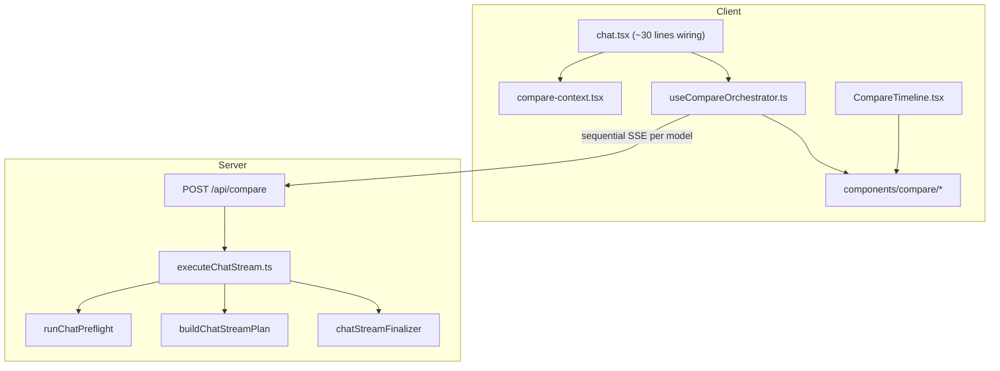

# Model Comparison — Stacked Turns (Approach 3)

## Thermo-nuclear quality bar

[`components/chat.tsx`](components/chat.tsx) is **1,429 lines** — already past the 1k threshold. This feature is a **blocker** if it adds orchestration, grouping, or multi-stream logic inline.

**Non-negotiable constraints for this PR:**
- **Zero net growth** in `chat.tsx` (target: **-50 to -100 lines** by extracting compare wiring and reusing new modules)
- **No scattered `if (compareMode)` branches** across submit, stop, metrics, file upload, or preset paths — one delegation point only
- **No second `useChat` instance** — compare bypasses AI SDK transport entirely
- **No N× naive `/api/chat`** on the same `chatId` (breaks [`lib/chat-stop-registry.ts`](lib/chat-stop-registry.ts), daily usage increment in [`lib/chat/chatPreflight.ts`](lib/chat/chatPreflight.ts), and persistence races in [`lib/chat/chatStreamFinalizer.ts`](lib/chat/chatStreamFinalizer.ts))

**Code-judo move:** extract shared stream execution once, then compare becomes a thin orchestrator over that executor — not a parallel code path.

---

## Product shape (v1 — text-only)

Per your scope choice:

| Enabled | Disabled in compare mode |
|---------|--------------------------|
| Multi-model text prompts (2–3 models) | MCP tools |
| Stacked response cards per turn | Web search |
| Collapsible older turns | Image generation |
| Credit estimate before send | Presets |
| "Continue with this model" (promote winner) | File/image attachments |
| Latency + token metrics per card | |

Max **3 models** per comparison (credit + UX guardrail).

---

## Architecture



### Data model per turn

One user message + N assistant messages share a `comparisonTurnId`:

```
user          comparisonTurnId=T1  modelId=null
assistant     comparisonTurnId=T1  modelId=openrouter/gpt-4o-mini
assistant     comparisonTurnId=T1  modelId=openrouter/claude-3-haiku
assistant     comparisonTurnId=T1  modelId=openrouter/llama-3.1-8b
user          comparisonTurnId=T2  ...
```

Combine with the existing [`docs/message-model-attribution-plan.md`](docs/message-model-attribution-plan.md) — **one migration**, not two:

```sql
ALTER TABLE messages ADD COLUMN model_id text;
ALTER TABLE messages ADD COLUMN model_provider text;
ALTER TABLE messages ADD COLUMN model_display_name text;
ALTER TABLE messages ADD COLUMN comparison_turn_id text;
CREATE INDEX idx_messages_comparison_turn ON messages(chat_id, comparison_turn_id);
```

Wire through [`lib/chat-store.ts`](lib/chat-store.ts) `convertToDBMessages` / `convertToUIMessages` using the same pattern as `hasWebSearch`.

---

## Phase 1 — Extract stream executor (prerequisite, no user-visible feature)

**Goal:** shrink [`app/api/chat/route.ts`](app/api/chat/route.ts) and give compare a single reuse point.

Create [`lib/chat/executeChatStream.ts`](lib/chat/executeChatStream.ts):

```ts
export async function executeChatStream(params: {
  req: Request;
  body: ChatRequestBody;
  options?: {
    streamKey?: string;           // default userId:chatId
    skipClientPersist?: boolean;  // compare orchestrator persists once
    skipDailyIncrement?: boolean; // compare counts as 1 daily message
  };
}): Promise<Response>
```

Move from `route.ts` into executor:
- MCP init, `buildChatStreamPlan`, `streamText`, finalizer wiring
- Abort registration using **parameterized `streamKey`** (extend [`lib/chat-stop-registry.ts`](lib/chat-stop-registry.ts): `userId:chatId:streamKey`)

Refactor [`app/api/chat/route.ts`](app/api/chat/route.ts) to ~80 lines: parse body → preflight (once) → `executeChatStream` → return response.

**Quality check:** route.ts line count drops; no behavior change for normal chat.

---

## Phase 2 — Compare API orchestrator

Create [`app/api/compare/route.ts`](app/api/compare/route.ts) with typed body:

```ts
interface CompareRequestBody {
  chatId: string;
  messages: UIMessage[];
  compareModels: string[];       // 2–3 slugs
  comparisonTurnId: string;
  apiKeys: Record<string, string>;
  // text-only v1: no mcpServers, webSearch, imageGeneration
}
```

Create [`lib/chat/compareOrchestrator.ts`](lib/chat/compareOrchestrator.ts) (server-side):

1. Auth + **aggregate credit validation** (sum costs for all models via existing [`lib/services/chatCreditValidationService.ts`](lib/services/chatCreditValidationService.ts))
2. **Increment daily usage once** (not N times)
3. Persist user message once with `comparisonTurnId`
4. For each model **sequentially** (stacked turns, simplest persistence):
   - Build per-model history: prior turns only (exclude sibling compare assistants from same turn)
   - Call `executeChatStream` with `skipClientPersist: true`, `skipDailyIncrement: true`, `streamKey: modelId`
   - Collect assistant message + stream to client as tagged events
5. Batch-persist all N assistant messages at end of turn

**Stream protocol (client-friendly):**

```
event: model-start   data: { modelId, index }
event: text-delta    data: { modelId, delta }
event: model-finish  data: { modelId, messageId, latencyMs, usage }
event: turn-complete data: { comparisonTurnId }
```

Alternative if simpler: return NDJSON lines instead of SSE — pick one format and document in `SPEC.md`.

Add [`lib/chat/compareHistory.ts`](lib/chat/compareHistory.ts):

```ts
export function buildModelHistory(
  allMessages: CompareUIMessage[],
  modelId: string,
  comparisonTurnId: string
): UIMessage[]
```

Single canonical function — **no** ad-hoc filtering in route or hook.

---

## Phase 3 — Client compare subsystem

### Context

[`lib/context/compare-context.tsx`](lib/context/compare-context.tsx):

```ts
compareModeEnabled: boolean
compareModels: string[]          // max 3
toggleCompareMode()
addModel / removeModel
estimatedCreditCost: number
```

Persist `compareModels` to localStorage separately from [`lib/context/model-context.tsx`](lib/context/model-context.tsx) `selectedModel` — do not overload single-model state.

### Orchestrator hook

[`hooks/useCompareOrchestrator.ts`](hooks/useCompareOrchestrator.ts):

- Owns compare streaming state (`statusByModel`, `activeTurnId`)
- On submit: generate `comparisonTurnId`, append user message, open N placeholder assistant rows, `fetch('/api/compare')` with streaming reader
- Updates `setMessages` incrementally per model (same pattern as `useChat` but explicit)
- Stop: call `/api/chat` stop action with composite key or new `/api/compare/stop`
- **Promote winner:** set `compareModeEnabled = false`, set `selectedModel`, trim sibling assistants from current turn (or hide them), continue normal chat

### Compare policy (avoid spaghetti)

[`lib/compare/comparePolicy.ts`](lib/compare/comparePolicy.ts):

```ts
export function getCompareRestrictions() {
  return { mcp: false, webSearch: false, imageGen: false, presets: false, attachments: false };
}
export function canSubmitCompare(input, models, credits): SubmitGateResult
```

`chat.tsx` calls **one** function at submit time — not six inline checks.

---

## Phase 4 — UI components

All new UI lives under [`components/compare/`](components/compare/):

| Component | Role |
|-----------|------|
| `CompareModeBar.tsx` | Model chips, "+ Add", credit estimate (~3 cr) |
| `CompareModelPicker.tsx` | Multi-select built on existing model list data from `useModel()` |
| `ComparisonTurnGroup.tsx` | Collapsible turn wrapper (expanded = latest, collapsed = older) |
| `CompareResponseCard.tsx` | Model header, latency, streaming state, Copy, "Continue with this" |
| `CompareTimeline.tsx` | Groups flat messages by `comparisonTurnId`, renders turns |

Modify [`components/messages.tsx`](components/messages.tsx) minimally:

```tsx
if (compareModeEnabled) {
  return <CompareTimeline messages={messages} ... />;
}
return /* existing flat map */;
```

**Do not** bloat [`components/message.tsx`](components/message.tsx) (~574 lines) with compare layout — cards are a separate component reusing [`Markdown`](components/markdown.tsx) for text parts only.

Match the mockup in [`canvases/model-comparison-mockup.canvas.tsx`](/Users/garthscaysbrook/.cursor/projects/Users-garthscaysbrook-Code-chatlima/canvases/model-comparison-mockup.canvas.tsx):

- Compare bar above message list
- User bubble → stacked cards
- Collapsed older turns
- Input footer: "Sends to all N models"

Entry point: toggle in [`components/textarea.tsx`](components/textarea.tsx) — swap `ModelPicker` for `CompareModelPicker` when compare mode is on (mirror web-search toggle pattern).

---

## Phase 5 — Minimal chat.tsx integration

Add only:

```tsx
const { compareModeEnabled } = useCompare();
const compare = useCompareOrchestrator({ chatId, setMessages, messages });

// handleSubmit:
if (compareModeEnabled) {
  return compare.submit(input);
}
// existing path unchanged
```

Disable irrelevant controls via `ComparePolicy` (hide MCP/web search/image toggles, disable file attach).

Wire stop button to `compare.stop()` when in compare mode.

**Extract while here (pay down god-component debt):**
- Move file-upload submit block (~80 lines) to `hooks/useChatFileSubmit.ts` if needed to keep net line count negative

---

## Phase 6 — Tests, docs, verification

**Unit tests:**
- [`lib/chat/compareHistory.test.ts`](lib/chat/compareHistory.test.ts) — history shaping per model
- [`lib/compare/comparePolicy.test.ts`](lib/compare/comparePolicy.test.ts) — gate logic
- Extend [`__tests__/lib/chat-store.test.ts`](__tests__/lib/chat-store.test.ts) — `comparisonTurnId` + `modelId` round-trip

**API test:**
- [`__tests__/api/compare-route.test.ts`](__tests__/api/compare-route.test.ts) — auth, credit sum, daily increment once, N assistants persisted

**Update [`SPEC.md`](SPEC.md):**
- New section: Compare Mode (text-only v1 constraints, credit rules, message schema, API contract)

**Verification commands:**
```bash
pnpm lint
pnpm test:unit -- compareHistory comparePolicy chat-store
pnpm build
```

**Manual QA checklist:**
- 3-model compare turn renders stacked cards with streaming
- Older turn collapses
- "Continue with this" exits compare mode on chosen model
- Credits deducted N×; daily limit incremented 1×
- Reload chat restores grouped turns from DB columns

---

## Phasing / delivery

| Phase | Delivers | Risk |
|-------|----------|------|
| 1 | Stream executor extract | Low — refactor only |
| 2 | `/api/compare` + schema migration | Medium — persistence |
| 3–4 | Client orchestrator + UI | Medium — streaming UX |
| 5 | chat.tsx wiring + toggle | Low if phases 1–4 done |
| 6 | Tests + SPEC | Required before merge |

Ship phases 1–2 behind no UI first (API testable), then 3–5 as user-visible feature.

---

## Future (explicitly out of v1)

- Parallel model generation (faster, harder persistence)
- Web search / MCP per model
- Side-by-side grid view toggle
- Share/export comparison turns
- Diff view between two selected responses

These should be **new modules**, not flags bolted onto v1 paths.
