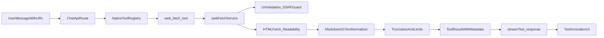

# Native Web Fetch for Chatlima

## Outcome

Implement first-party URL reading in chat without requiring MCP, by adding a native `web_fetch` tool in the existing chat tool pipeline. Phase 1 covers single-page extraction; Phase 2 adds explicit whole-site crawling.

## Current integration points (confirmed)

- Chat tool execution and system instruction assembly are in `[app/api/chat/route.ts](app/api/chat/route.ts)`.
- Existing service pattern to mirror is `[lib/services/chatWebSearchService.ts](lib/services/chatWebSearchService.ts)`.
- Tool invocation rendering already exists in `[components/tool-invocation.tsx](components/tool-invocation.tsx)` and message composition in `[components/message.tsx](components/message.tsx)`.
- User-side settings state pattern exists in `[lib/context/web-search-context.tsx](lib/context/web-search-context.tsx)`.
- Existing feature-flag pattern exists in `[lib/config/access-policy.ts](lib/config/access-policy.ts)`.
- Existing web-search credit model constant exists in `[lib/tokenCounter.ts](lib/tokenCounter.ts)`.

## Architecture plan

## Phase 1: Native single-page fetch

### 1) Add feature-gated backend service

- Create `[lib/services/webFetchService.ts](lib/services/webFetchService.ts)` with:
  - URL validation (`http/https` only)
  - SSRF protections (deny localhost, loopback, RFC1918/private ranges)
  - timeout + max response bytes (e.g. 10-15s, 5MB)
  - content-type allowlist (`text/html`, optional `text/plain`/`text/markdown`)
  - readability extraction (`jsdom` + `@mozilla/readability`) and normalization
  - deterministic truncation (`maxChars`, default 30k) with `truncated` marker
  - stable output envelope (`finalUrl`, `title`, `content`, `truncated`, `contentType`, `fetchedAt`)

### 2) Register native tool in chat route

- Extend `[app/api/chat/route.ts](app/api/chat/route.ts)`:
  - add `web_fetch` tool (alongside existing `read_file` + MCP tools)
  - merge into `allTools` so it is available to any model supporting tool calls
  - update default system instruction to prefer native `web_fetch` when user asks to read/summarize/analyze a URL
  - keep explicit fallback messaging when fetch fails (retry, smaller page, or MCP/web search fallback)

### 3) Add fetch policy + feature flag config

- Extend `[lib/config/access-policy.ts](lib/config/access-policy.ts)` with fetch flags:
  - `nativeWebFetchEnabled` (default false initially)
  - optional safety knobs (`nativeWebFetchMaxChars`, `nativeWebFetchTimeoutMs`, `nativeWebFetchMaxBytes`)
- Wire route behavior to hard-disable the tool when feature is off.

### 4) UX alignment (no major redesign)

- Reuse existing invocation UI in `[components/tool-invocation.tsx](components/tool-invocation.tsx)` and `[components/message.tsx](components/message.tsx)`.
- Add tool display label mapping so `web_fetch` reads as user-friendly “Reading URL”.
- Ensure assistant content includes source URL and truncation notice (from tool result) for transparency.

### 5) Dependency and implementation choice

- Phase 1 extractor stack: `ofetch` + `jsdom` + `@mozilla/readability` + markdown conversion helper (if needed).
- Avoid paid API dependency and avoid browser rendering in baseline phase.

### 6) Tests and verification

- Add unit tests for service behavior under `[lib/services/__tests__/](lib/services/__tests__/)`:
  - URL validation / SSRF blocking
  - content-type filtering
  - timeout + size-limit behavior
  - extraction + truncation determinism
- Add route-level test coverage for tool wiring and feature-flag gating (in API/chat tests location used by repo).
- Extend UI tests for tool invocation status text (existing pattern in `[__tests__/components/tool-invocation.test.tsx](__tests__/components/tool-invocation.test.tsx)`).

### 7) Documentation/spec updates

- Update `[SPEC.md](SPEC.md)` to reflect new native tool and API/tool behavior (Sections 2, 8, 9, 11 where relevant).
- Update `[README.md](README.md)` feature bullets for native web fetch.

## Phase 2: Optional whole-site mode

### Trigger model

- Only activate when user explicitly requests crawl/site-wide context (not default URL behavior).

### Implementation track

- Add a crawl strategy module (likely wrapping `sitefetch`) with strict bounds:
  - same-domain default true
  - `maxPages` default 20
  - `depth` default 2
  - aggregate char/token cap
- Keep output page-scoped with per-page source metadata, then chunk before passing to model.
- Keep phase behind separate flag (`nativeWebFetchSiteModeEnabled`) until validated.

## Defaults to use unless changed later

- Multiple URLs in one prompt: fetch first URL in Phase 1 and prompt before fetching additional URLs.
- Default content cap: `30000` chars.
- No internal-domain allowlist in baseline (secure deny by default).
- Whole-site mode hidden until Phase 2 flag is enabled.

## Rollout

- Internal enablement only first (`nativeWebFetchEnabled=true` in dev/staging).
- Measure success/failure and latency via existing logging style in chat services.
- Expand to production default-on after stability and error-rate review.

