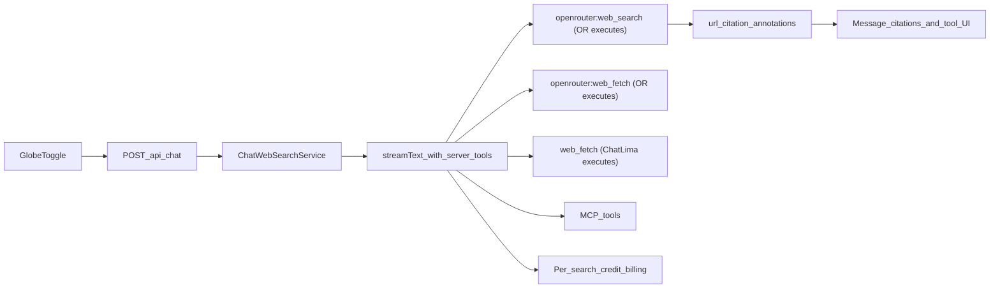

# OpenRouter Agentic Web Tools Migration

## Current state

ChatLima does **not** call `plugins: [{ id: "web" }]` directly, but uses the equivalent deprecated pattern:

- Appends `:online` to the OpenRouter model slug in [`app/api/chat/route.ts`](app/api/chat/route.ts) (lines 903–922)
- Passes `web_search_options.search_context_size` via `providerOptions.openrouter` (lines 943–947)
- Always runs **one** search per request when the Globe toggle is on
- Charges a flat **5 credits** whenever web search is enabled, regardless of whether search actually ran ([`lib/tokenCounter.ts`](lib/tokenCounter.ts))

Separately, ChatLima already has a **native client-side** `web_fetch` tool ([`lib/services/webFetchService.ts`](lib/services/webFetchService.ts)) gated by `NATIVE_WEB_FETCH_ENABLED`.

## Target state

Per [OpenRouter's migration guide](https://openrouter.ai/docs/guides/features/server-tools/web-search):

| Before (deprecated) | After (server tools) |
|---|---|
| `model: "openai/gpt-4:online"` | `model: "openai/gpt-4"` + server tools |
| `web_search_options.search_context_size` | `openrouter.tools.webSearch({ searchContextSize })` |
| Always searches once | Model decides 0–N searches per request |
| Plugin always runs | Requires **tool-calling** model |



## Step 0: Create feature branch (before any implementation)

Per [feature-branch-creation-workflow.mdc](.cursor/rules/feature-branch-creation-workflow.mdc), create an isolated branch from latest `main` **before** touching dependencies or web-search code:

```bash
git checkout main
git pull origin main
git checkout -b feature/openrouter-agentic-web-tools
git push -u origin feature/openrouter-agentic-web-tools
```

**Branch name:** `feature/openrouter-agentic-web-tools`

**Notes:**
- Stash or commit any unrelated local changes first (current workspace has uncommitted edits in `package.json`, `.codex/environments/environment.toml`, and untracked `docs/architecture/` files — do not include those in this branch unless intentional)
- All implementation commits go on this branch; use conventional commits (`feat:`, `fix:`, etc.)
- Deploy to Vercel preview only (`vercel deploy`, never `--prod`) when ready to test
- May overlap with prior AI SDK v6 work documented in [fix-ai-sdk-v6-upgrade-9683a3bb.plan.md](.cursor/plans/fix-ai-sdk-v6-upgrade-9683a3bb.plan.md) — reconcile or reuse that branch if it already exists locally

## Prerequisite: dependency upgrade

Current pins block first-class server tool support:

- [`package.json`](package.json): `ai@4.3.9`, `@openrouter/ai-sdk-provider@^0.4.5`, `@ai-sdk/*@^1.x`
- Required: `ai@^6`, `@openrouter/ai-sdk-provider@^2.6` (adds `openrouter.tools.webSearch()` in [provider CHANGELOG 2.6.0](https://github.com/OpenRouterTeam/ai-sdk-provider/blob/main/CHANGELOG.md))

**Upgrade scope** (single PR or dedicated pre-migration PR):

- Bump `ai`, `@ai-sdk/react`, and all `@ai-sdk/*` provider packages to AI SDK 6–compatible versions
- Bump `@openrouter/ai-sdk-provider` to latest 2.x
- Fix breaking changes across ~15 files importing from `ai` / `@ai-sdk/react`:
  - [`app/api/chat/route.ts`](app/api/chat/route.ts) — `streamText`, `tool()`, message types
  - [`components/chat.tsx`](components/chat.tsx) — `useChat` API
  - [`ai/providers.ts`](ai/providers.ts) — provider factory usage
  - MCP tool wiring in [`lib/services/chatMCPServerService.ts`](lib/services/chatMCPServerService.ts)
  - Jest mocks in [`jest.setup.js`](jest.setup.js) and component tests

Run `pnpm build`, `pnpm lint`, `pnpm test:unit`, and a smoke E2E chat test after the upgrade before layering web-tool changes.

## Backend: replace plugin pattern with server tools

### 1. Extend [`lib/services/chatWebSearchService.ts`](lib/services/chatWebSearchService.ts)

Centralize logic currently duplicated inline in `route.ts`:

- **Remove** `getWebSearchModelId()` (`:online` suffix) and `createWebSearchOptions()` (`web_search_options`)
- **Add** `buildOpenRouterServerTools(openrouterClient, config)` returning:
  ```ts
  {
    web_search: openrouterClient.tools.webSearch({
      searchContextSize: config.contextSize, // maps low|medium|high
      engine: 'auto',
      maxTotalResults: config.maxTotalResults ?? 10,
    }),
    web_fetch: openrouterClient.tools.webFetch({
      engine: 'auto',
      maxContentTokens: config.maxContentTokens ?? /* derived from contextSize */,
    }),
  }
  ```
- **Add model gating**: web search requires OpenRouter model **with tool-calling support** (parse `supported_parameters` from OpenRouter model metadata in [`lib/models/provider-configs.ts`](lib/models/provider-configs.ts); add `supportsToolCalling?: boolean` to [`lib/types/models.ts`](lib/types/models.ts))
- Keep existing credit/permission checks (signed-in, ≥5 credits, BYOK bypass)

### 2. Update [`app/api/chat/route.ts`](app/api/chat/route.ts)

When `webSearchConfig.enabled` and model supports tools:

- Use **standard model ID** (no `:online` suffix) via `getLanguageModelWithKeys` / `createOpenRouterClientWithKey`
- Merge server tools into `allTools`:
  ```ts
  const openrouterClient = createOpenRouterClientWithKey(...);
  const serverTools = ChatWebSearchService.buildOpenRouterServerTools(openrouterClient, webSearchConfig);
  const allTools = { ...tools, read_file, ...serverTools, ...(webFetchPolicy.enabled ? { web_fetch } : {}) };
  ```
- **Remove** `modelOptions.web_search_options`
- Update system instruction block (lines 1035–1042) to explain:
  - `web_search` is available when Globe is on; model decides if/when to search
  - Prefer **OpenRouter `web_fetch`** for URLs discovered during search
  - Prefer **native `web_fetch`** for explicit user-provided URLs when both are available

When web search is enabled but model lacks tool support: disable web search for that request and log a diagnostic (no silent `:online` fallback — deprecated path should be removed).

### 3. Feature flag in [`lib/config/access-policy.ts`](lib/config/access-policy.ts)

Add `openrouterAgenticWebToolsEnabled` (env: `OPENROUTER_AGENTIC_WEB_TOOLS_ENABLED`, default `false` initially) to allow staged rollout. When off, web search toggle behaves as today (`:online` path) until flag is flipped — **or** skip legacy path entirely if you prefer a hard cutover after testing.

**Recommendation**: keep a temporary fallback behind the flag for one release, then remove `:online` code.

## Billing: per-invocation instead of per-toggle

Agentic search breaks the current flat-fee model.

| Scenario | Old billing | Proposed billing |
|---|---|---|
| Globe on, model never searches | 5 credits | 0 extra credits |
| Globe on, 1 search | 5 credits | 5 credits |
| Globe on, 3 searches | 5 credits | 15 credits (capped by `max_total_results`) |

Changes:

- Count `web_search` tool invocations from `onFinish` step data / response tool calls in [`app/api/chat/route.ts`](app/api/chat/route.ts)
- Set `additionalCost = searchInvocationCount * WEB_SEARCH_COST` (keep `WEB_SEARCH_COST = 5`)
- Update `hasWebSearch` DB flag: true when search tool was **actually invoked** or `url_citation` annotations exist (not just when toggle was on) — [`lib/db/schema.ts`](lib/db/schema.ts) fields unchanged
- Credit pre-check in [`lib/services/chatCreditValidationService.ts`](lib/services/chatCreditValidationService.ts): require ≥5 credits to **enable** capability (one search minimum reserve); optionally require `WEB_SEARCH_COST * maxTotalResults` for multi-search safety
- OpenRouter `web_fetch` server tool: OpenRouter bills ~$0.001/fetch via OR credits; decide whether to pass through as a separate constant or absorb into search cost for v1

## UI / UX updates

Minimal changes, reuse existing patterns:

- [`components/tool-invocation.tsx`](components/tool-invocation.tsx): friendly labels — `web_search` → "Searching the web", OR `web_fetch` → "Fetching page (OpenRouter)"
- [`components/textarea.tsx`](components/textarea.tsx): update cost hint from fixed "Base + 5" to "5 credits per search (model decides if needed)"; disable Globe when model lacks tool-calling
- [`components/web-search-suggestion.tsx`](components/web-search-suggestion.tsx): keep post-search disable nudge; copy reflects per-search pricing
- [`components/settings/preferences-tab.tsx`](components/settings/preferences-tab.tsx): keep context size selector; optionally expose `max_total_results` (default 10) in a follow-up
- [`components/message.tsx`](components/message.tsx): already detects `web_search` tool invocations (line 192) — verify with server-tool streaming in AI SDK 6

## Tests

| Area | Files |
|---|---|
| Service unit tests | [`lib/services/__tests__/chatWebSearchService.test.ts`](lib/services/__tests__/chatWebSearchService.test.ts) — server tool builder, tool-calling gate, no `:online` |
| Billing | [`lib/services/__tests__/chatTokenTrackingService.test.ts`](lib/services/__tests__/chatTokenTrackingService.test.ts), credit validation tests |
| UI | [`__tests__/components/textarea.test.tsx`](__tests__/components/textarea.test.tsx), [`__tests__/components/message.test.tsx`](__tests__/components/message.test.tsx) |
| Integration | Manual/API smoke: enable Globe → factual query → verify tool invocation in stream + citations; follow-up without search → verify 0 extra credits |

## Documentation

Update [`SPEC.md`](SPEC.md) Section 7.3 and 8.1:

- Web search uses OpenRouter server tools (not `:online` plugin)
- Billing is per search invocation
- Native `web_fetch` and OpenRouter `web_fetch` coexist with documented preference order

## Rollout sequence

1. **Create branch** `feature/openrouter-agentic-web-tools` from latest `main` and push upstream
2. **Upgrade deps** (AI SDK 6 + provider 2.x) — validate build/tests green
3. **Implement server tools** behind `OPENROUTER_AGENTIC_WEB_TOOLS_ENABLED`
4. **Update billing** to per-invocation counting
5. **UI copy + tool labels**
6. **Enable flag in staging** — compare latency, citation quality, credit accuracy vs `:online`
7. **Enable in production** — remove deprecated `:online` path after one stable week

## Risks and mitigations

- **AI SDK 6 upgrade blast radius**: isolate in its own commit/PR before web-tool logic
- **Non-tool models**: hide/disable Globe for models without tool support; show tooltip explaining why
- **Variable cost surprise**: cap `max_total_results`, update textarea cost messaging, keep web-search-suggestion nudge
- **Tool name collision**: native `web_fetch` and OR server tool may share similar names in the stream — use distinct tool keys (`web_fetch` vs OR provider key) and label mapping in UI
- **Provider beta**: OpenRouter marks server tools as beta; keep feature flag for quick rollback to `:online`

## Out of scope (follow-ups)

- Engine selector UI (`auto` / `exa` / `parallel` / `native`)
- Domain allow/block lists in settings
- Replacing native `web_fetch` entirely
- `openrouter:datetime` or other server tools
