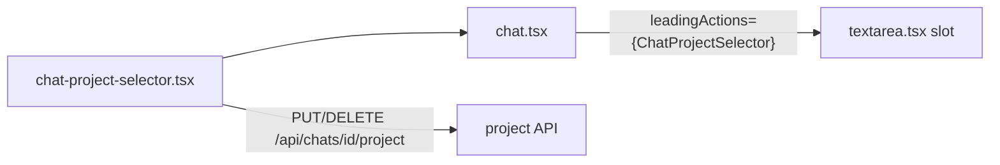

# Move project linking into composer toolbar

## Goal

Remove the full-width `Project: Link a project` row above the input and replace it with a toolbar icon that opens the existing link/switch/unlink dropdown. Reclaim vertical chat space while keeping linked-project state discoverable.

## Concrete UI decision

**Icon-only control** (matches paperclip / image / globe):

- Unlinked: neutral `FolderKanban` icon; tooltip `Link a project`
- Linked: primary/highlighted icon (same treatment as web search when on); tooltip shows project name; dropdown includes Switch + Unlink
- Placement: first in the right-side action group, before `CompareModeToggle` / paperclip
- No desktop name chip (keeps the bar compact and avoids another responsive branch)

## Code-judo constraint (thermo-nuclear)

`[components/textarea.tsx](components/textarea.tsx)` is already **1021 lines**. Do **not** import projects hooks, APIs, or `ChatProjectSelector` internals into it.

Instead:

1. Add a thin, project-agnostic slot: `leadingActions?: React.ReactNode` on `Textarea`
2. Render that slot at the start of the action-buttons group (~3 lines)
3. Keep all project fetch/link/unlink/UI in `[components/projects/chat-project-selector.tsx](components/projects/chat-project-selector.tsx)`
4. Wire from `[components/chat.tsx](components/chat.tsx)`: pass the selector via `leadingActions`, remove the standalone row above the form




This avoids feature leakage into the shared composer and avoids growing `textarea.tsx` further with project conditionals.

## Implementation steps

### 1. Compact `ChatProjectSelector`

Rewrite the render in `[components/projects/chat-project-selector.tsx](components/projects/chat-project-selector.tsx)`:

- Delete the outer `Project:` label row (`mb-2` flex row)
- Trigger = round icon button matching toolbar classes used by paperclip/globe in `textarea.tsx`
- Reuse existing `DropdownMenu` content for list / switch / unlink
- When linked: highlight trigger + `aria-label` / tooltip with name; keep unlink as a menu item (or keep the small X inside the menu) so the toolbar stays one control
- Preserve early `return null` when `!chatId || !userId`
- Preserve existing React Query keys and mutation toasts

### 2. Slot into composer without coupling

In `[components/textarea.tsx](components/textarea.tsx)`:

- Add optional `leadingActions?: React.ReactNode` to `InputProps`
- Insert `{leadingActions}` at the start of the action-buttons `div` (around the `CompareModeToggle` block)
- No other project-aware branches

### 3. Wire from chat

In `[components/chat.tsx](components/chat.tsx)` (~1420–1447):

- Remove the standalone `<ChatProjectSelector />` above `<Textarea />`
- Pass it as:

```tsx
<Textarea
  ...
  leadingActions={
    chatId && session?.user ? (
      <ChatProjectSelector chatId={chatId} userId={userId ?? session.user.id} />
    ) : null
  }
/>
```

### 4. Spec + verification

- Update `[SPEC.md](SPEC.md)` §8.3 to note that chat–project linking is a composer toolbar control (not a separate row above the input)
- Run focused checks: `pnpm lint` on touched files; existing textarea unit tests should still pass (new prop is optional)
- Manual smoke: unlinked → link → highlighted icon → switch → unlink; anonymous/no-chat still hides control

## Out of scope

- Projects sidebar / create-project flows
- API or schema changes
- Desktop name chip next to the icon
- Broad refactor of `textarea.tsx` control bar (tempting, but not required for this change)

