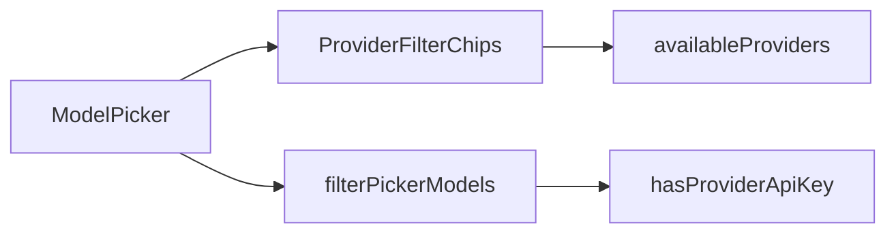

# Provider chip row for model picker

## Decision

Implement canvas **Option 1**: horizontal provider chips under All / Favorites, plus a separate **BYOK** chip that combines with provider (e.g. Groq + BYOK). Providers that already have a user key show a small KEY mark.

## Code-judo constraint (thermo-nuclear)

[`components/model-picker.tsx`](components/model-picker.tsx) is already **879 lines**. Inlining chips + more filter branches would push it toward/over 1k and tangle an already busy component. Do **not** grow that file with UI + filter logic.

Reframe as three thin pieces:

1. **Pure filter** — one function owns tab + search + provider + BYOK
2. **Chip UI** — presentational list derived from models + key status
3. **Picker** — only holds state and wires the two

## Implementation

### 1. Extract pure filtering + BYOK key check

Add [`lib/models/filter-picker-models.ts`](lib/models/filter-picker-models.ts) (or `components/model-picker/` if you prefer colocating UI-only helpers — prefer `lib/models/` so unit tests stay free of React):

- Move / reuse the existing `hasApiKeyForProvider` keyMap from [`components/model-picker.tsx`](components/model-picker.tsx) into a shared helper, e.g. `hasProviderApiKey(modelId, userApiKeys)`.
- Export `filterPickerModels({ models, activeTab, favorites, searchTerm, providerFilter, byokOnly, userApiKeys })`:
  - favorites tab → `favorites.includes(id)`
  - `providerFilter !== 'all'` → `model.provider === providerFilter`
  - `byokOnly` → `hasProviderApiKey(model.id, userApiKeys)`
  - search (existing name / provider / capability match)
  - sort by name
- Export `listProvidersWithKeyStatus(models, userApiKeys)` → unique `model.provider` values (stable sort) + `hasKey` boolean (true if any model for that provider has a user key).

Replace the current `filteredAndSortedModels` useMemo body with a call to `filterPickerModels`. Delete the inline `hasApiKeyForProvider` duplicate from the picker once callers use the shared helper.

### 2. Extract chip row component

Add [`components/model-picker-provider-chips.tsx`](components/model-picker-provider-chips.tsx):

- Props: `providers: { name: string; hasKey: boolean }[]`, `selectedProvider: string | 'all'`, `byokOnly: boolean`, `onProviderChange`, `onByokChange`, `showByokChip: boolean` (true when `userApiKeys` has any non-empty key).
- UI: horizontal scrollable row under the existing All / Favorites tabs in the popover header (same visual language as the mockup: compact chips, KEY mark on keyed providers, active chip uses primary border / fill).
- Chips: **All** + each provider + optional **BYOK**.
- Accessibility: `role="listbox"` / `aria-pressed` or toggle-button semantics; keyboard not required beyond click for v1 if tabs already own focus.

Keep this file presentational — no filtering logic.

### 3. Wire into ModelPicker (minimal delta)

In [`components/model-picker.tsx`](components/model-picker.tsx):

- State: `providerFilter: string | 'all'` (default `'all'`), `byokOnly: boolean` (default `false`).
- Derive `providers` via `useMemo` → `listProvidersWithKeyStatus(availableModels, userApiKeys)`.
- Render `<ModelPickerProviderChips … />` between the All/Favorites tab bar and the search input (see ~L538–570).
- Extend the keyboard-focus reset effect deps to include `providerFilter` and `byokOnly`.
- Count label continues to reflect `filteredAndSortedModels.length` against the current tab’s total (no new copy system).

Net line change in `model-picker.tsx` should stay small (state + one component + thinner useMemo). If the file still drifts upward, move getProviderIcon / capability helpers out in the same PR only if needed to stay under 1k — do not do a drive-by rewrite.

### 4. SPEC + tests

- Update [`SPEC.md`](SPEC.md) briefly where model selection UX is described (or add a short Model Picker note under UI): All / Favorites stack with provider chips + optional BYOK chip; filters combine.
- Unit tests for `filterPickerModels` / `listProvidersWithKeyStatus` in `__tests__/lib/models/filter-picker-models.test.ts` (favorites × provider × BYOK × search).
- Extend [`__tests__/components/model-picker.test.tsx`](__tests__/components/model-picker.test.tsx) with 1–2 interaction cases: click provider chip narrows list; BYOK chip + provider combine. Prefer asserting via accessible names / roles, not brittle class strings.

### 5. Verify

- `pnpm test:unit -- filter-picker-models` (and focused model-picker tests)
- `pnpm lint` on touched files

## Out of scope

- My keys tab and provider dropdown options
- Persisting last provider/BYOK filter across sessions
- Changing credit gating / catalog fetch behavior
