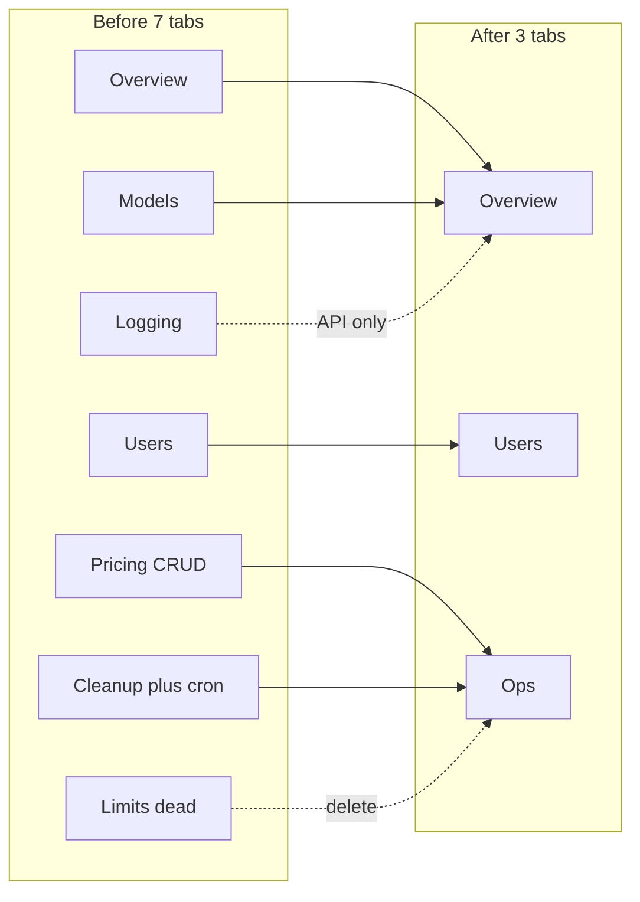

# Simplify Admin Dashboard

## Code-judo framing

The admin surface is a mini-product nobody needs. Collapse it to the jobs you actually do: **see usage → inspect users → sync prices / purge anon users**. Delete schedule theater, configuration theater (Limits), and orphan bootstrap pages.

**Chosen end state (3 tabs):**

1. **Overview** — system stats + model analytics (merge Models into Overview)
2. **Users** — usage table without fake plan/% columns
3. **Ops** — Sync Pricing + read-only pricing table + manual Cleanup (preview → confirm → execute → logs)

---

## Phase 1 — Delete cleanup cron/schedule (highest conviction)

You confirmed cron never worked and manual cleanup is fine. Delete the automated path entirely.

**Delete files:**

- [app/api/admin/cleanup-users/schedule/route.ts](app/api/admin/cleanup-users/schedule/route.ts)
- [app/api/admin/cleanup-users/emergency-disable/route.ts](app/api/admin/cleanup-users/emergency-disable/route.ts)
- [app/api/admin/cleanup-users/health/route.ts](app/api/admin/cleanup-users/health/route.ts)
- [app/api/admin/cleanup-users/count-only/route.ts](app/api/admin/cleanup-users/count-only/route.ts)
- [lib/services/cleanupMonitoringService.ts](lib/services/cleanupMonitoringService.ts)

**Trim:**

- [vercel.json](vercel.json) — remove `crons` array; keep `functions` memory/duration for manual execute
- [app/api/admin/cleanup-users/execute/route.ts](app/api/admin/cleanup-users/execute/route.ts) — remove `isCronExecution`, `matchesCronSchedule` (dead), cron config gate, skip-confirmation-for-cron; keep manual POST + GET stats + `CleanupConfigService.logExecution`
- [lib/services/cleanupConfigService.ts](lib/services/cleanupConfigService.ts) — keep `logExecution` / `getLogs` / history; drop `getConfig` / `updateConfig`
- [components/admin/AdminUserCleanup.tsx](components/admin/AdminUserCleanup.tsx) — delete Schedule tab, schedule queries/mutations, “Auto Cleanup Enabled” badge; keep Overview + Logs. **Must land under 1000 lines** (currently 1119)

**Schema:** leave `cleanup_config` and `cleanup_execution_logs` tables in place this PR (no migration risk). Stop reading/writing `cleanup_config`. Drop the table in a later cleanup if desired.

**Keep:** `preview`, manual `execute`, `logs`, [lib/services/userCleanupService.ts](lib/services/userCleanupService.ts), CLI scripts.

---

## Phase 2 — Collapse tabs and delete dead admin product

**Rewrite shell** [components/admin/AdminDashboard.tsx](components/admin/AdminDashboard.tsx):

- 3 tabs: `overview` | `users` | `ops`
- Overview mounts `AdminSystemStats` + `AdminModelAnalytics`
- Ops mounts slim pricing + slim cleanup
- Remove stub Export button
- Move Sync Pricing into Ops (not global header)
- Fix Refresh to invalidate only keys that exist (`admin-system-stats`, `admin-users`, `admin-model-analytics`, cleanup keys, pricing query once Pricing uses React Query)

**Delete Limits tab (not enforced in chat):**

- Remove from dashboard
- Delete [components/admin/AdminUsageLimits.tsx](components/admin/AdminUsageLimits.tsx)
- Delete [app/api/admin/usage-limits/route.ts](app/api/admin/usage-limits/route.ts) and `[id]/route.ts`
- Delete dead [lib/services/optimizedUsageLimits.ts](lib/services/optimizedUsageLimits.ts)
- Keep [lib/services/usageLimits.ts](lib/services/usageLimits.ts) + `/api/limits/usage` only if still referenced; otherwise delete those too (chat uses `DailyMessageUsageService` + credits, not this table)

**Delete Logging tab from nav:**

- Remove [components/admin/LoggingHealthDashboard.tsx](components/admin/LoggingHealthDashboard.tsx) from dashboard
- Keep [app/api/admin/logging-health/route.ts](app/api/admin/logging-health/route.ts) + [lib/services/loggingMonitor.ts](lib/services/loggingMonitor.ts) for on-call curl (no UI)

**Pricing → sync + read-only:**

- Replace [components/admin/AdminPricingManagement.tsx](components/admin/AdminPricingManagement.tsx) CRUD with a small Ops section: Sync button + paginated read-only table via `GET /api/pricing/models`
- Leave `PUT /api/pricing/models` in the API (unused by UI) or delete PUT if nothing else calls it — prefer delete PUT path from admin UX only; API PUT can stay one release if scripts need it

**Delete orphan pages:**

- [app/admin-setup/page.tsx](app/admin-setup/page.tsx)
- [app/admin-test/page.tsx](app/admin-test/page.tsx)
- [app/api/admin/test-pricing-sync/route.ts](app/api/admin/test-pricing-sync/route.ts) (GET is unauthenticated)

Canonical bootstrap remains `scripts/set-admin.ts`.

---

## Phase 3 — Fix correctness and auth duplication

**Misleading metrics** in [app/api/admin/system-stats/route.ts](app/api/admin/system-stats/route.ts) + [AdminSystemStats.tsx](components/admin/AdminSystemStats.tsx):

- Rename `requestsToday` → `requestsInRange` (or compute real calendar-today separately)
- Rename `systemUptime` → `requestSuccessRate`; drop the fake `99.9` default (use `0` or null when no data)

**Fake user fields** in [app/api/admin/users/route.ts](app/api/admin/users/route.ts) + [AdminUserBreakdown.tsx](components/admin/AdminUserBreakdown.tsx):

- Remove `plan` and `usagePercentage` from API response and UI (columns, filters, progress bars)
- Keep tokens, cost, requests, lastActive, isActive

**One admin gate:** replace ~30 copy-pasted session/DB/`role||isAdmin` blocks in `app/api/admin/`** with `AuthMiddleware.requireAdmin` from [lib/middleware/auth.ts](lib/middleware/auth.ts). Same for [app/admin/page.tsx](app/admin/page.tsx) (reuse helper or thin server wrapper). Remove production `console.log` spam from the admin page.

---

## Phase 4 — Spec and docs

Update [SPEC.md](SPEC.md) §9 Admin API and §10 Admin Dashboard:

- Manual-only cleanup (no scheduled cron)
- Removed endpoints listed above
- 3-tab dashboard description
- Bootstrap via `scripts/set-admin.ts`

Trim schedule/health references in [scripts/README.md](scripts/README.md) if present.

---

## Out of scope (do not mix in)

- Token extraction unification (separate plan)
- Wiring `usage_limits` into chat preflight
- Dropping `cleanup_config` / `usage_limits` DB tables (follow-up migration)
- New Polar plan column on Users (can add later with real data)

---

## Verification

- `pnpm lint` on touched files
- Manual smoke: `/admin` loads with 3 tabs; Overview stats; Users without plan/%; Ops sync pricing; Cleanup preview dry-run + logs
- Confirm `vercel.json` has no crons
- Confirm deleted routes 404
- Confirm non-admin still redirects from `/admin`

