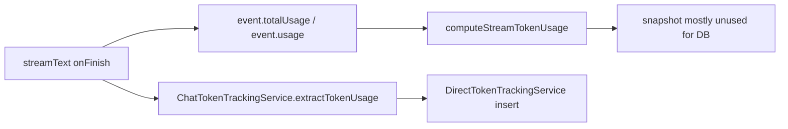
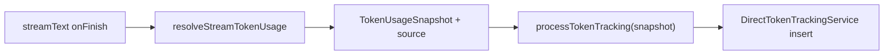

# Unify token extraction on AI SDK totalUsage

## Problem

Today the finish path weighs the package twice:

1. `[lib/chat/streamTokenUsage.ts](lib/chat/streamTokenUsage.ts)` `computeStreamTokenUsage` builds a snapshot (and even re-sums `event.steps`).
2. `[lib/services/chatTokenTrackingService.ts](lib/services/chatTokenTrackingService.ts)` `extractTokenUsage` **ignores that snapshot** and re-parses `event.usage` / response with a weaker helper that does not prefer AI SDK totals.

AI SDK 6 already sets `onFinish` `usage` / `totalUsage` to the **combined usage of all steps**. Re-extracting (and optionally re-summing steps) is incidental complexity that can diverge from the SDK.




## Target design (code judo)

One extractor, one consumer:




**Chosen approach:** Prefer AI SDK totals; do not re-aggregate steps when SDK usage is present. Keep a thin char-based estimate only when SDK usage is missing/zero. Record `source` on the snapshot and in `token_usage_metrics.metadata` so estimates are not silently treated as provider truth.

Out of scope: streaming UI estimates, MCP truncation, per-message UI wiring, deleting dead `processStoppedStreamTokenTracking` (only tests call it — leave for a follow-up).

## Implementation

### 1. Make `[lib/chat/streamTokenUsage.ts](lib/chat/streamTokenUsage.ts)` the only resolver

Rewrite `computeStreamTokenUsage` → clearer `resolveStreamTokenUsage` (keep old name as alias only if needed for minimal churn; prefer rename + update call sites).

Priority order:

1. `event.totalUsage` (AI SDK combined)
2. `event.usage` (AI SDK sets this to the same combined total on finish)
3. `response.usage` if present
4. Sum `event.steps[].usage` **only if** the above yield no usable input/output
5. Char `/4` estimate from messages + system instruction (last resort)

Return:

```ts
type TokenUsageSnapshot = {
  inputTokens: number;
  outputTokens: number;
  totalTokens: number;
  source: 'ai_sdk' | 'steps' | 'estimated';
};
```

Normalize field names once (`inputTokens` / `outputTokens`; tolerate legacy `promptTokens` / `completion_tokens` only inside this helper). Delete the step-sum **override** of already-good SDK totals — that is the main simplification.

Keep `estimateTimeToFirstTokenMs` / `computeTokensPerSecond` in the same file (already the timing helpers used by the finalizer).

### 2. Stop re-extracting in `[lib/services/chatTokenTrackingService.ts](lib/services/chatTokenTrackingService.ts)`

Change `processTokenTracking` to **require** a `TokenUsageSnapshot` argument and pass `inputTokens` / `outputTokens` straight into `DirectTokenTrackingService.processTokenUsage`.

Delete private methods that become dead:

- `extractTokenUsage`
- `extractInputTokensFromEvent`
- `estimateOutputTokens`

Keep `extractGenerationId` and credit/timing orchestration here — this service remains the chat→billing adapter, not a second tokenizer.

### 3. Wire once in `[lib/chat/chatStreamFinalizer.ts](lib/chat/chatStreamFinalizer.ts)`

In `processStreamFinish` / `trackTokenUsage`:

- Resolve snapshot **once** via `resolveStreamTokenUsage`
- Use it for TPS (`computeTokensPerSecond`)
- Pass the same snapshot into `processTokenTracking`
- Remove the “compute then ignore” pattern (`state.tokenUsageData` computed but DB path re-extracts)

### 4. Persist source in `[lib/services/directTokenTracking.ts](lib/services/directTokenTracking.ts)`

Extend `processTokenUsage` params with optional `usageSource?: 'ai_sdk' | 'steps' | 'estimated'` and write it into existing `metadata` alongside `creditsConsumed`. No schema migration.

### 5. Tests

- Add focused unit tests for `resolveStreamTokenUsage`:
  - prefers `totalUsage` over step sums
  - falls back to steps when SDK usage empty
  - estimates when nothing present + sets `source: 'estimated'`
- Update `[lib/services/__tests__/chatTokenTrackingService.test.ts](lib/services/__tests__/chatTokenTrackingService.test.ts)`: pass snapshot into `processTokenTracking`; remove tests that poked private `extractTokenUsage` / `extractInputTokensFromEvent`.

### 6. Spec

Brief note in `[SPEC.md](SPEC.md)` under chat/token tracking: completed turns persist AI SDK combined usage (`totalUsage`/`usage`); estimates are marked in metadata.

## Verification

- `pnpm test:unit` for the touched token-tracking / streamTokenUsage tests
- `pnpm lint` on edited files

## Explicit non-goals

- No change to credit-tier billing math
- No MCP result truncation
- No user-facing usage dashboard work
- No rewrite of legacy `[lib/tokenTracking.ts](lib/tokenTracking.ts)` `TokenTrackingService.trackTokenUsage` (scripts/admin path; not the live chat finish path)

