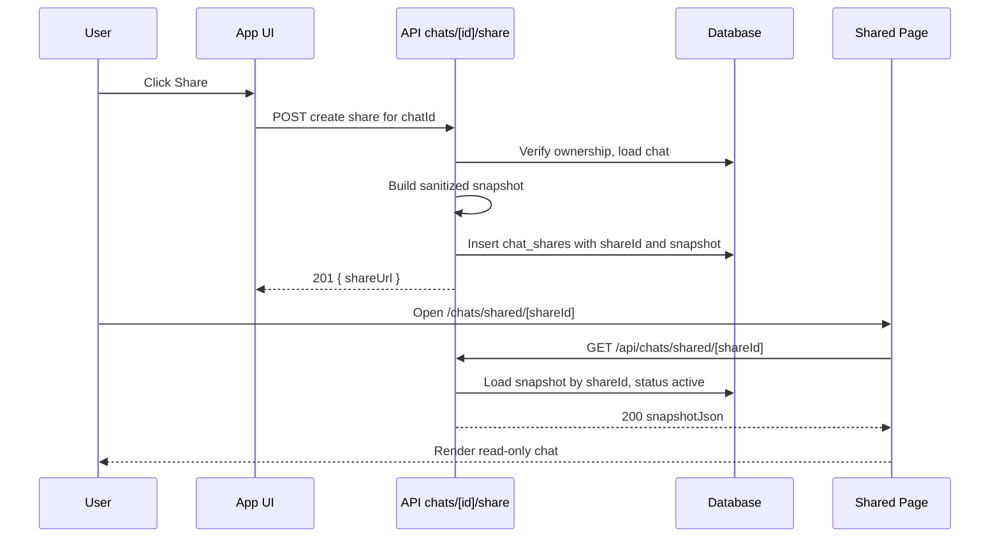

# Chat Sharing Feature Plan

This document outlines three design options for enabling chat sharing, recommends an MVP scope, and details the architecture, data model, APIs, UI, security/redaction, analytics, and rollout plan.

## Goals
- Allow users to share chats that are private by default.
- Provide clear privacy controls and the ability to revoke access.
- Start with a minimal, safe implementation that can evolve to richer sharing models.

## Options Overview

### Option 1: Share via unlisted link (private-by-link)
- Description: Generate a random `shareId` and publish a read-only snapshot accessible at an unlisted URL. Not indexed or discoverable.
- Pros: Fastest, minimal privacy/legal surface, aligns with private-by-default.
- Cons: Link can leak; no per-viewer access controls.
- UX:
  - Share button in chat view.
  - Dialog: Create share link → copy URL.
  - Ability to revoke link to disable access.

### Option 2: Share to specific users (access-controlled)
- Description: Owner designates signed-in users allowed to view. Server enforces identity.
- Pros: Stronger privacy and control (per-user revoke, auditability).
- Cons: Requires identity management UX, invites or lookups; increased complexity.
- UX:
  - Share dialog to add users by email or userId.
  - Viewers must sign in.

### Option 3: Public gallery post (discoverable)
- Description: Publish to a public listing with metadata (title, tags), author profile, reactions.
- Pros: Community value, discoverability, SEO.
- Cons: Highest moderation/compliance needs; reporting tools required.
- UX:
  - Publish flow with title/tags.
  - Appears on a public /chats/shared index.

## Recommended MVP: Option 1 (Unlisted link + Immutable Snapshot)
- Rationale: Smallest viable surface, safest defaults, reuses existing patterns (similar to Preset sharing).
- Scope:
  - Create immutable snapshot at time of sharing.
  - Serve snapshot at /chats/shared/[shareId] (read-only).
  - Revoke to disable access.

## Architecture

- Frontend: Next.js App Router.
- Backend: API routes under `app/api/chats`.
- DB: Drizzle ORM migrations.
- Reuse: Patterns from Preset sharing (`app/api/presets/[id]/share/` and `app/api/presets/shared/[shareId]/`).

### High-level Flow (Option 1)


## Data Model

### Table: chat_shares
- id: uuid (primary key)
- chatId: uuid (FK to chats table)
- ownerUserId: uuid (FK to users)
- shareId: text (random slug, unique)
- status: text enum [active, revoked] (default: active)
- visibility: text enum [unlisted] (future: public, private)
- snapshotJson: jsonb (sanitized message transcript and metadata)
- createdAt: timestamp (default now)
- revokedAt: timestamp (nullable)

Optional (later):
- chat_share_views: for view analytics.

### Snapshot Structure (example)
```json
{
  "version": 1,
  "chat": {
    "title": "How to deploy Next.js",
    "createdAt": "2025-07-01T12:00:00Z"
  },
  "messages": [
    {
      "id": "m1",
      "role": "user",
      "content": "How do I deploy a Next.js app?",
      "createdAt": "2025-07-01T12:01:00Z"
    },
    {
      "id": "m2",
      "role": "assistant",
      "content": "Use Vercel or Node server... ",
      "createdAt": "2025-07-01T12:02:00Z"
    }
  ],
  "metadata": {
    "models": ["openai:gpt-4o-mini"],
    "redaction": {
      "hideSystemPrompts": true,
      "hideToolArgs": true,
      "mediaPolicy": "safe-only"
    }
  }
}
```

## API Surface

- POST /api/chats/[id]/share
  - Auth required. Validate ownership.
  - Build sanitized snapshot from the chat.
  - Insert `chat_shares` with `shareId`.
  - Response: 201 { shareUrl, shareId }

- DELETE /api/chats/[id]/share
  - Auth required. Validate ownership.
  - Set status = revoked and revokedAt = now for the active share for that chat (or all for chat).
  - Response: 200 { revoked: true }

- GET /api/chats/shared/[shareId]
  - Public endpoint.
  - Return 404 if not found or status != active.
  - Response: 200 snapshotJson

Notes:
- Single active share per chat initially to simplify UX; can support multiple shares later.

## UI and UX

- Share Button
  - Location: Chat header (and overflow menu in chat list).
  - States:
    - Not shared: “Create share link”
    - Shared: Show link with copy button; “Disable link”
  - Confirmation: Show brief text explaining unlisted link behavior and privacy.

- Shared Page
  - Route: /chats/shared/[shareId]
  - Behavior: Server fetches snapshot via API or directly server-side; render read-only transcript using existing components (`Messages`, `Message`, `Markdown`) with interactive features disabled.
  - Empty/Invalid: Show friendly 404.

## Sanitization and Redaction Policy (Default)

- Remove system/hidden prompts.
- Remove tool call arguments and internal metadata unless explicitly marked safe.
- Media:
  - By default, omit private attachments and any non-public URLs.
  - Optional flag in future to reissue signed URLs with short expiry or move to public bucket if policy allows.
- Identity:
  - Do not expose owner email or internal IDs in snapshot.
  - Display neutral attribution like “Shared chat”.
- Model/provider:
  - Optionally list high-level model names; omit provider keys or configurations.

## Observability/Analytics (Optional)
- Minimal logs for share create/revoke.
- Optional future: `chat_share_views` counting with basic throttling (e.g., IP hash + window).

## Security Considerations
- Immutable snapshot decouples shared content from live chat.
- Revoke immediately disables GET access.
- Random, high-entropy `shareId` (e.g., 24-32 char URL-safe).
- Ensure CORS/headers do not leak additional info.
- Rate-limit GET to prevent brute-forcing shareIds.

## Rollout Plan
1. Implement Option 1 with snapshot and revoke.
2. Ship behind a feature flag if needed.
3. Add unit/integration tests:
   - API create/revoke.
   - GET returns snapshot and 404 after revoke.
   - Redaction correctness (system prompts, tools, attachments).
4. Incrementally consider:
   - Access-controlled shares (Option 2).
   - Public gallery (Option 3) with moderation.

## Risks and Mitigations
- Link leakage: Unlisted share can be forwarded. Mitigate via revoke, optional view counters, and clear UX.
- PII exposure: Redaction defaults prioritize safety; allow explicit opt-in for including system prompts.
- Media handling: Start with conservative exclusion.

## Future Extensions
- Multiple concurrent share links per chat with labels.
- Expiring links or password-protected shares.
- Per-viewer ACLs; audit logs.
- Public gallery with reporting/moderation.

## Files and Areas Likely Touched (for implementation)
- Drizzle migration: `drizzle/00xx_chat_shares.sql` and snapshots in `drizzle/meta`.
- API:
  - `app/api/chats/[id]/share/route.ts` (POST, DELETE)
  - `app/api/chats/shared/[shareId]/route.ts` (GET)
- Pages:
  - `app/chats/shared/[shareId]/page.tsx`
- Components:
  - Share dialog/button in chat UI (e.g., `components/chat.tsx` or header component).
- Services/Lib:
  - Snapshot builder and redaction utilities under `lib/services` or `lib`.
  - DB access under `lib/db`.

## Decision to Implement
- Three options offered; recommended MVP is Option 1 (unlisted link + snapshot).
- Awaiting further instruction after this plan is committed.