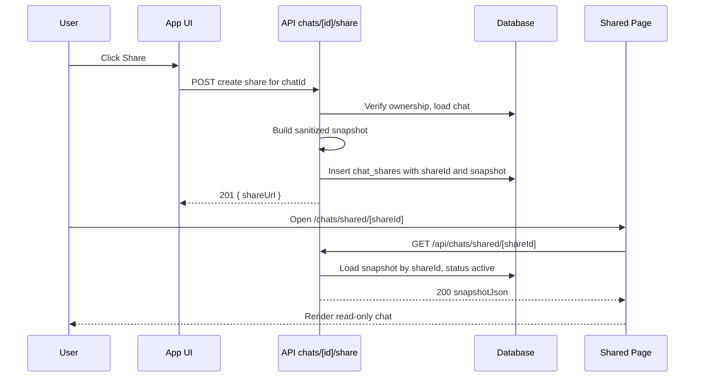

# Chat Sharing Feature Plan

This document outlines three design options for enabling chat sharing, records final scope decisions, and details the architecture, data model, APIs, UI, redaction, analytics, and rollout for the MVP.

## Final Decisions (Approved)
- Option: Option 1 — Unlisted link sharing
- Snapshot: Immutable snapshot at time of sharing
- Redaction: Remove API keys, emails, user PII; hide system prompts; hide tool args; exclude media/attachments entirely
- Analytics: Basic anonymous view counter (no PII)
- Media: Not included initially
- Legal: Show confirmation dialog referencing terms; require explicit consent to publish

## Goals
- Allow users to share chats that are private by default.
- Provide clear privacy controls and the ability to revoke access.
- Ship a safe, minimal MVP that can evolve to access-controlled and public gallery later.

## Options Overview

### Option 1: Share via unlisted link (private-by-link) — MVP
- Description: Generate a random `shareId` and publish a read-only snapshot accessible at an unlisted URL. Not indexed or discoverable.
- Pros: Fastest, minimal privacy/legal surface, aligns with private-by-default.
- Cons: Link can leak; no per-viewer access controls.
- UX:
  - Share button in chat view.
  - Dialog: Create share link → copy URL.
  - Ability to revoke link to disable access.

### Option 2: Share to specific users (access-controlled) — Later
- Description: Owner designates signed-in users allowed to view. Server enforces identity.
- Pros: Stronger privacy and control (per-user revoke, auditability).
- Cons: Requires identity management UX and invites; increased complexity.

### Option 3: Public gallery post (discoverable) — Later
- Description: Publish to a public listing with metadata (title, tags), author profile, reactions.
- Pros: Community value, discoverability, SEO.
- Cons: Highest moderation/compliance needs; reporting tools required.

## Architecture

- Frontend: Next.js App Router
- Backend: API routes under `app/api/chats`
- DB: Neon Postgres via Drizzle ORM
- Reuse: Patterns from Preset sharing (`app/api/presets/[id]/share/` and `app/api/presets/shared/[shareId]/`)

### High-level Flow (Option 1)


## Data Model (Neon + Drizzle)

### Table: chat_shares
- id: uuid primary key
- chatId: uuid not null references chats(id)
- ownerUserId: uuid not null references users(id)
- shareId: text not null unique (URL-safe slug, 24–32 chars)
- status: text enum [active, revoked] default active
- visibility: text enum [unlisted] default unlisted
- snapshotJson: jsonb not null (sanitized message transcript and metadata)
- viewCount: integer not null default 0
- createdAt: timestamp with time zone default now()
- revokedAt: timestamp with time zone nullable

Indexes:
- unique(shareId)
- index on (chatId, status)
- index on (ownerUserId, status)

Optional later:
- chat_share_views for per-view analytics; not needed initially.

### Snapshot Structure (example)
```json
{
  "version": 1,
  "chat": {
    "title": "How to deploy Next.js",
    "createdAt": "2025-07-01T12:00:00Z"
  },
  "messages": [
    {
      "id": "m1",
      "role": "user",
      "content": "How do I deploy a Next.js app?",
      "createdAt": "2025-07-01T12:01:00Z"
    },
    {
      "id": "m2",
      "role": "assistant",
      "content": "Use Vercel or Node server... ",
      "createdAt": "2025-07-01T12:02:00Z"
    }
  ],
  "metadata": {
    "models": ["openai:gpt-4o-mini"],
    "redaction": {
      "hideSystemPrompts": true,
      "hideToolArgs": true,
      "excludeMedia": true,
      "piiRemoved": true
    }
  }
}
```

## Redaction Policy (MVP)
- Remove system/hidden prompts.
- Remove tool call arguments and internal metadata.
- Exclude all media/attachments and any non-public or signed URLs.
- Remove API keys, emails, phone numbers, and basic PII from message content via conservative regex filtering.
- Do not expose owner email or internal IDs in snapshot.
- Optionally list high-level model names; omit provider config.

Notes:
- Keep redaction conservative to avoid leaks.
- Add a redaction banner in snapshot metadata for transparency.

## API Surface

- POST /api/chats/[id]/share
  - Auth required. Validate ownership of chat.
  - Build sanitized immutable snapshot from the chat.
  - If an active share already exists for this chat, either return it or create new based on UX (MVP: return existing to keep single active share).
  - Insert or upsert into `chat_shares`.
  - Response: 201 { shareUrl, shareId }

- DELETE /api/chats/[id]/share
  - Auth required. Validate ownership.
  - Set status = revoked and revokedAt = now for the active share for that chat (or all for chat, MVP: all).
  - Response: 200 { revoked: true }

- GET /api/chats/shared/[shareId]
  - Public endpoint.
  - Return 404 if not found or status != active.
  - Increment `viewCount` in a rate-limited fashion (best-effort).
  - Response: 200 snapshotJson

Rate-limiting view counts:
- Simple approach: update `viewCount = viewCount + 1` with lightweight guard to avoid hot loops (e.g., throttle by IP hash in memory for 60s if running serverfully, or accept overcounting as MVP).

## UI and UX

- Share Button and Dialog
  - Location: Chat header and/or chat overflow menu.
  - States:
    - Not shared: “Create share link”
    - Shared: Show link with copy button; “Disable link” (revoke)
  - Consent:
    - A checkbox: “I understand this creates an unlisted public link and agree to the Terms.”
    - Link to Terms.

- Shared Page
  - Route: /chats/shared/[shareId]
  - Rendering: Use existing read-only components (`Messages`, `Message`, `Markdown`), disable interactions and tool triggers.
  - Empty/Invalid: Display friendly 404.

## Observability/Analytics
- Log share creations and revocations with chatId and ownerUserId.
- `viewCount` integer on `chat_shares` incremented on GET.
- No PII stored for viewers.

## Security Considerations
- Immutable snapshot decouples shared content from live chat.
- Revoke immediately disables GET access.
- High-entropy `shareId` (URL-safe).
- Rate-limit GET or accept minimal overcounting.
- Ensure response headers don’t leak internal IDs.
- CORS defaults (same-origin GET) unless page needs client-side fetch; prefer server-side rendering.

## Rollout Plan
1. Implement Option 1 with snapshot and revoke.
2. Add unit/integration tests:
   - API create/revoke.
   - GET returns snapshot and 404 after revoke.
   - Redaction correctness (system prompts, tools, PII removal, media exclusion).
   - View counter increments.
3. Ship behind a soft feature flag if needed.
4. Monitor logs and feedback.

## Risks and Mitigations
- Link leakage: Mitigate with revoke, clear UX, and optional expiration in future.
- PII exposure: Conservative redaction and no media; add regex filters and tests.
- Overcounting views: Acceptable MVP trade-off; harden later.

## Future Extensions
- Multiple concurrent share links per chat with labels and expirations.
- Per-viewer ACLs; audit logs; invite flows.
- Public gallery with moderation and reporting.
- Enhanced analytics (unique viewers, geos, retention).
- Optional media-including shares with signed-URL proxying.

## Implementation Notes (File Map)
- Drizzle migration: `drizzle/00xx_chat_shares.sql` and meta snapshots
- API:
  - `app/api/chats/[id]/share/route.ts` (POST, DELETE)
  - `app/api/chats/shared/[shareId]/route.ts` (GET)
- Pages:
  - `app/chats/shared/[shareId]/page.tsx`
- Components:
  - Share dialog/button in chat UI (likely `components/chat.tsx` or header)
- Services/Lib:
  - Snapshot builder and redaction utilities under `lib/services` or `lib`
  - DB access under `lib/db`

## Test Plan (MVP)
- API:
  - POST create share: 201 with shareId; snapshot has redaction flags set and media excluded.
  - DELETE revoke: 200; GET 404 afterward.
  - GET shared: 200 returns snapshot; increments `viewCount`.
- Redaction:
  - System prompts and tool args are absent.
  - PII regex removes emails, keys, phone numbers in user/assistant content.
  - No attachments or media URLs included.
- UI:
  - Share dialog requires consent checkbox before enabling “Create link”.
  - Copied link matches GET endpoint.
  - Shared page renders transcript read-only and shows redaction banner if desired.
